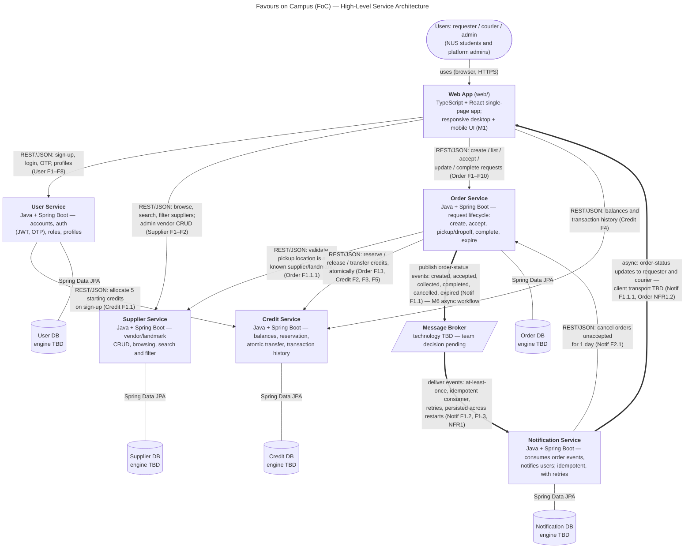

<!--
  AI-assisted (CS3219 AI Usage Policy disclosure):
  Tool: Claude Code (Fable 5), 2026-09-14.
  Scope: transcribed the team-decided architecture (AGENTS.md service
  boundaries + D1 requirements interactions) into this diagram/document.
  No architecture or design decisions were made by the tool; open
  decisions are marked "TBD" for the team. Reviewed by: Leong Wei Zhi
  (via pull request).
-->

# Favours on Campus (FoC) — High-Level Service Architecture

**Diagram type:** free-form service-level (container-level) architecture
diagram. It shows every deployable component, the databases they own, and
all runtime relationships between them, traced back to the D1
requirements (`F`/`NFR` references). All technology choices shown were
decided by the team; anything marked **TBD** ("to be decided") is a
pending team decision, deliberately left open.

## Legend (notation)

| Notation | Meaning |
| --- | --- |
| Rectangle | A deployable service — its own Spring Boot app in its own Docker container (M7), one per top-level folder |
| Rounded/stadium shape | People using the system through a browser |
| Parallelogram | Message broker (infrastructure component, technology TBD) |
| Cylinder | A database owned by **exactly one** service; no service reads another service's database |
| Thin arrow `-->` | **Synchronous** REST/JSON call over HTTP; the arrow points from caller to callee (request direction; the response returns along the same call) |
| Thick arrow `==>` | **Asynchronous** event/message flow; the arrow points in the direction the data (event) travels |
| Plain line `---` | Database access via Spring Data JPA (only ever from the owning service) |
| `F… / NFR… / M… / N…` on a line | The D1 requirement or course-mandated item that this relationship implements |
| **TBD** | A decision the team has not made yet (kept open on purpose) |

**Authentication note:** every Web → service call carries a JWT issued by
the User Service on login (User F7.1); each service rejects requests the
caller's role does not permit (User F6.1.5). Token-validation mechanics
(shared `JWT_SECRET` per `.env.example`) are configuration, not a runtime
call, so no arrow is drawn for it.

**Abbreviations:** REST = HTTP/JSON web APIs · JWT = JSON Web Token ·
OTP = one-time password · JPA = Java Persistence API (Spring Data JPA) ·
SPA = single-page application · CRUD = create/read/update/delete ·
TBD = to be decided.

## Dependency summary (traceable to the D1 backlog)

| From → To | Style | Purpose | Requirement |
| --- | --- | --- | --- |
| Web → User Service | sync REST | sign-up, login, OTP, profiles; JWT issued here | User F1–F8 |
| Web → Supplier Service | sync REST | browse/search/filter vendors; admin vendor CRUD | Supplier F1–F2 |
| Web → Order Service | sync REST | create/list/accept/update/complete requests | Order F1–F10 |
| Web → Credit Service | sync REST | balances, transaction history | Credit F4 |
| Notification Service → Web | async (transport TBD) | order-status updates to requester and courier | Notif F1.1.1, Order NFR1.2 |
| User Service → Credit Service | sync REST | allocate 5 starting credits on sign-up | Credit F1.1 |
| Order Service → Supplier Service | sync REST | validate pickup location is a known supplier/landmark | Order F1.1.1 |
| Order Service → Credit Service | sync REST | reserve on create, release on cancel/expiry, atomic transfer on completion | Order F13; Credit F2, F3, F5 |
| Order Service → Broker → Notification Service | **async events** | order-status events (created/accepted/collected/completed/cancelled/expired); at-least-once, idempotent consumer, retries, persisted | Notif F1, NFR1; **M6** |
| Notification Service → Order Service | sync REST | cancel orders unaccepted for 1 day | Notif F2.1 |

## Decisions still open (team, not AI)

- **Message broker technology** for the M6 async workflow.
- **Database engine(s)** — one database per service is decided; engines are not.
- **Client update transport** for Notification → Web (e.g. how F1.1.1
  updates reach the browser).

An exported image of this diagram (SVG/PNG) is kept with the D1
document; this Mermaid source is the version of record.
