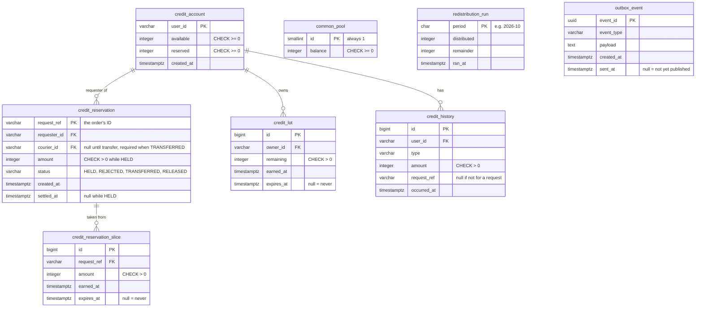

<!--
  AI-assisted (CS3219 AI Usage Policy disclosure):
  Tool: Claude Code (Opus 5.5), 2026-10-09.
  Scope: typo and punctuation fixes, and the author's own rewording of
  D3 applied verbatim (PR #163 Copilot review). No design content was
  written or decided by the tool in this change.
  2026-10-09, PR #163 review (Leong Wei Zhi): pre-saga residue removed (ownership
  note, error-mapping row, lot spend order, closed-economy rule,
  legend), the two invariants stated as Leong Wei Zhi proposed and the
  author chose, and the Notification row updated for the author's
  decision that request.submitted notifies the requester.
  2026-10-10: the author's decisions for the request event handler and
  topology written in (D10, D11, the handler row, the operation results
  table and its rules, the failure rows, F1.2.1 and NFR1.1). The
  decisions are the author's; the tool transcribed them. Same day: the
  "Read API contract" section, from the author's written contract.
  2026-10-10, PR #168 review (Leong Wei Zhi): the reserve results split
  by refusal cause, the duplicate-reply wording, the unhandled-event
  rule and the below-5 s bound on the retry delay restored. The
  decisions are the team's; the tool transcribed them.
  Author review: Ryan Ang, pending pull request review.
-->

# FoC Credit Service — Architecture Design

**Scope:** component-level design of `credit-service/`, covering
Credit Service requirements (F1 closed credit economy, F2 credit reservation, F3 credit transfer, F4 credit balance and history, F5 transfer atomicity, F6 redistribution, NFR1 responsiveness, NFR2 integrity), and the other requirements that it serves: rejecting request creation when the reward exceeds the available balance (Order F1.1.4) and viewing credit balance on the user profile (User Service F8.1). \
Companion diagram:
[`credit-service.mmd`](credit-service.mmd) \
High-level system architecture: [`architecture.md`](architecture.md)

## Design decisions
| # | Concern | Decision | Serves |
| --- | --- | --- | --- |
| D1 | Persistence | **PostgreSQL** accessed via Spring Data JPA and use of `@Transactional`| F5, NFR2.1 |
| D2 | Concurrency control | **Pessimistic row locks** | F2.1.2, NFR2.1 |
| D3 | Duplicate detection | **One held-credits record per request**, with a unique request reference. Its status records what has already been decided and done, so a redelivered event changes nothing and never produces a second, different reply. | NFR2.2, NFR2.2.1 |
| D4 | Expiry model | Earned credits live in lots that expire 3 months after they are earned into a common pool. Lots are spent in soonest expiry order first. Redistributed credits expiry are started the date they are received | F6.1–F6.1.2 |
| D5 | Credit history | **Append-only**: each row has type, amount, timestamp and request reference. Filters will use JPA. | F4.1.1, F4.1.2, F4.1.3 |
| D6 | Account provisioning | **Get or create method inside Credit Service**. Call is made idempotent by a unique user ID. Account with 5 available credits is created the first time a trusted ID is seen. Every path that writes a row referencing a user get-or-creates that user's account first: a balance or history read (the JWT's user), reserve (the requester), release, including the amount-0 `RELEASED` record (the requester), and transfer (the courier; the requester's already exists, since the `HELD` record references it). | F1.1, F1.1.1, F1.1.2 |
| D7 | Cross-service consistency | **Saga between the Order and Credit Services, by choreography.** Each service reacts to the other's events, and the request's status in the Order Service is the saga's state. No synchronous call exists between the two services. | F2, F3, NFR2 |
| D8 | Reservation | Saga step 1. The Credit Service consumes `request.submitted`, reserves or refuses, and replies with `credit.reserved` or `credit.reservation-rejected`. | F2.1, F2.1.2, F2.1.3 |
| D9 | Transfer and release | Saga endings. `request.completed` transfers the held credits. `request.cancelled` and `request.expired` release them, with release being the compensation for a reservation. | F2.1.1, F3.1, NFR1.1 |
| D10 | Reply publishing | **Transactional outbox.** The reply is written to an outbox table in the same transaction as the balance change, and a publisher sends it to the broker with publisher confirms and the mandatory flag: a reply is marked sent only when the broker confirmed it and did not return it as unroutable. | NFR2.1 |
| D11 | Event failure handling | Transient failures go to a retry queue and are redelivered after a short delay, up to a fixed number of attempts, then to a dead-letter queue. Events that conflict with the recorded state go straight to the dead-letter queue. The queue layout is the Notification Service's (a work, a retry and a dead-letter queue), with two differences: the four consumed routing keys are bound one by one instead of `request.#`, and the retry delay is 2 s with up to 5 attempts (`CREDIT_RETRY_TTL_MS`, `CREDIT_RETRY_MAX_ATTEMPTS`). The service declares both the `request-events` and `credit-events` exchanges, so it starts without the Order Service. | F5.1.1, NFR2.1 |
| D12 | Scheduler | Done by a **cron job** through use of `@Scheduled` | F6.1.1, F6.1.2 |

## The saga
 
| Step | Service | Local transaction | Publishes | If it fails |
| --- | --- | --- | --- | --- |
| 1 | Order | Save the request as `pending` | `request.submitted` (request, requester, reward) | N/A |
| 2 | Credit | Reserve the reward, or record the refusal | `credit.reserved` or `credit.reservation-rejected` | Refusal goes to step 3b |
| 3a | Order | `pending` → `created`. The request becomes visible to couriers | `request.created` | N/A |
| 3b | Order | `pending` → `rejected` (ends here) | `request.rejected` | N/A |
| 4 | Order | The request reaches `completed`, `cancelled` or `expired` | the matching request event | N/A |
| 5 | Credit | Transfer on `completed`; release on `cancelled` or `expired` | nothing | Cannot be refused. Retried until done |
 
- **Compensation:** release undoes a reservation. It runs when the
  request is cancelled or expires, including a `pending` request the
  Order Service gives up on because no reply arrived in time.
- **Point of no return:** delivery confirmation. After `request.completed`
  the transfer must happen and is only ever retried.
- **Eventually consistent:** a request is briefly `pending` before it is
  `created` or `rejected`, and balances change shortly after a request
  is completed, cancelled or expired, not in the same instant.

The four saga events, `request.submitted`, `request.rejected`,
`credit.reserved` and `credit.reservation-rejected`, are defined in
`foc-contracts` (records, registry entries and fixtures).

## Components

Ownership note: the Credit Service serves a read-only REST API to the
Web App; every balance change arrives as a request event. Its state lives only in its own PostgreSQL database (database-per-service). The only timer-driven work is the scheduler and outbox publisher.

| Component | Responsibility |
| --- | --- |
| **Credit account REST API** (Spring Boot) | For the Web App, authenticated by the user's JWT: returns the caller's available and reserved balance (F4.1) and their transaction history with amount and date-range filters (F4.1.2, F4.1.3). The routes and shapes are in "Read API contract". |
| **Request event listener** (Spring AMQP) | Consumes `request.submitted`, `request.completed`, `request.cancelled` and `request.expired` from the Credit Service's own queue, hands each to the request event handler, and settles the delivery on its answer: acknowledge after the commit, dead-letter an event that conflicts with the request's record, and send any failure to the retry queue (D11). |
| **Request event handler** (Spring Boot, `@Transactional`) | Owns the transaction for one event. Turns it into a reserve (F2.1), transfer (F3.1) or release (F2.1.1) operation and, for a reservation, writes the reply to the outbox in the same transaction (D10). Imports no broker types. |
| **Error mapping** (Spring Boot, `@RestControllerAdvice`) | Maps invalid query parameters on the read API (for example the history's amount and date-range filters) to HTTP error responses. Event-path failures never reach it: they are refused with a reply or dead-lettered (see "How each event is handled"). |
| **Idempotent credit operations service** (Spring Boot, `@Transactional`) | Core logic: provisions accounts with 5 available / 0 reserved, once per user (F1.1.1, F1.1.2). It reserves only if available credit >= amount needed (F2.1, F2.1.2, F2.1.3) and releases or transfers each request's held credits at most once (F2.1.1, F3.1.1, F3.1.2, NFR2.2.1). It spends lots in soonest-expiry order, with the never-expiring sign-up lot last (D4), and commits balance change, held-credits status, lots, history rows and the outgoing reply in one transaction (F5.1, NFR2.1) |
| **Credit history** (Spring Boot) | Appends one immutable row per transaction such as account provision, reservation, release, transfer, expiry, redistribution, with timestamps and request reference (F4.1.1). It will also serve the filtered history queries (F4.1.2, F4.1.3). |
| **Outbox publisher** (Spring Boot, `@Scheduled`) | Reads unsent replies from the outbox table, publishes them to the `credit-events` exchange with the mandatory flag, and marks each one sent once the broker confirms it without returning it. A returned reply stays unsent and is retried on the next poll (D10). |
| **Expiry and redistribution scheduler** (Spring Boot, `@Scheduled`) | Moves earned credits older than 3 months into the common pool (F6.1). At the start of each month, it shares the pool equally in integer amounts (F6.1.1) and gives the remainder to random users (F6.1.2). |
| **Credit Database** (PostgreSQL) | Holds credit accounts, held credits records, credit lots, common pool and history. |

## Database
 
### Choice: relational (PostgreSQL)
 
| What the Credit Service needs | Why a relational database fits |
| --- | --- |
| **Multi-row atomic updates** A transfer changes two accounts, one reservation, a credit lot, two history rows, and nothing if any part fails (F5.1, NFR2.1). | One ACID transaction spans all of those rows and tables. |
| **Safe concurrent updates** Two requests from the same requester, or a duplicate completion event, must not overdraw or pay twice (F2.1.2, NFR2.2). | `SELECT … FOR UPDATE` makes competing operations on the same account or reservation run one after the other. |
| **Strong consistency on reads** A user who has just reserved credits must see the reduced balance (F4.1). | Reads see committed data immediately. |
| **The queries** Balance by user, history by user filtered by amount or date range (F4.1.2, F4.1.3); lots by owner in expiry order; lots past their expiry. | All are simple indexed lookups and range scans on structured rows.  |
 
### Schema
 
User and request IDs are stored as opaque strings, since they belong to
other services. All amounts are integers (F1.2).
 

 
| Table (entity) | Represents | Why  |
| --- | --- | --- |
| `credit_account` (`CreditAccount`) | **A user's credit balances.** One row per user. | The primary key on `user_id` makes get-or-create happen once per user (D6). `available` and `reserved` are columns so that the balance read is one row and the non-negative rule is a `CHECK` (F2.1.2). |
| `credit_reservation` (`Reserved`) | **The reservation for one order.** One row per request. | The primary key on `request_ref` is the duplicate check (D3, NFR2.2.1). `status` records the outcome; `REJECTED` records a refusal so a redelivery gets the same answer. `courier_id` is filled in at transfer. |
| `credit_reservation_slice` | Which lots a reservation's credits came from. | Lets a release return credits with their original expiry (D4). `amount` is always positive. Indexed by `request_ref`, which is how a release reads them back. |
| `credit_lot` (`CreditLot`) | A user's available credits, split by expiry date. | Needed for 3-month expiry (F6.1). A null `expires_at` marks the sign-up credits, which never expire. A row is deleted when spent to zero. |
| `credit_history` (`CreditHistoryEntry`) | **The record of every credit operation.** Append-only. | One row per affected account per operation (F4.1.1). `amount` is always positive and `type` says which way it moved. Indexed by user and time for the history view (F4.1.2, F4.1.3). |
| `common_pool` | Expired credits awaiting redistribution. | A single row, enforced by `CHECK (id = 1)` (F6.1). |
| `redistribution_run` (`RedistributionRun`) | Months already redistributed. | The primary key on `period` lets only one run per month commit (F6.1.1). |
| `outbox_event` (`OutboxEvent`) | Replies waiting to be published. | Written in the same transaction as the balance change (D10). The unsent rows are indexed by `created_at`, which is the publisher's poll. |
 
History `type` values and what each does to the account's balances:
 
| Type | `available` | `reserved` |
| --- | --- | --- |
| `PROVISION` | + amount | |
| `RESERVE` | − amount | + amount |
| `RELEASE` | + amount | − amount |
| `TRANSFER_OUT` (requester) | | − amount |
| `TRANSFER_IN` (courier) | + amount | |
| `EXPIRY` | − amount | |
| `REDISTRIBUTION` | + amount | |
 
### How available, reserved and total are stored
 
- **Available** and **reserved** are two integer columns on the user's
  `credit_account` row.
- **Total is not stored.** It is always `available + reserved`, computed
  when read.
- Reserving moves an amount from `available` to `reserved` in a single
  `UPDATE` of one row, so the total is unchanged by construction.
`available` and `reserved` could be derived by summing lots and held
reservations instead. 
 
### How their consistency is maintained
 
1. **One transaction per operation.** The account row, the reservation,
   the lots, the history rows and any outgoing reply are written
   together or not at all (F5.1, NFR2.1).
2. **Row locks in a fixed order** (D2): reservation, then accounts by
   ascending user ID, then the common pool. Concurrent operations on the
   same rows queue up instead of reading stale balances.
3. **Database constraints.** A negative balance, a second reservation
   for the same request, a held reservation with no amount, or a
   transfer with no courier is rejected by PostgreSQL even if the
   service code is wrong.
4. **Two invariants** that every operation preserves, and that can be
   checked at any time (each check must return no rows):
   - a `HELD` reservation whose `amount` differs from the sum of its
     slices;
   - an account whose `reserved` differs from the sum of the amounts
     of its `HELD` reservations.
5. **The history is an independent second record.** Replaying a user's
   history rows with the table above reproduces their `available` and
   `reserved`, so the two can be reconciled against each other. Across
   all users, `sum(available + reserved) + common_pool.balance` equals
   the sum of all `PROVISION` rows.

## Diagram legend

Same notation as [`architecture.md`](architecture.md):

| Notation | Meaning |
| --- | --- |
| Rectangle | A software component (Spring Boot beans inside the service, or a neighbouring service) |
| Cylinder | The PostgreSQL database owned by the service |
| Thin arrow `-->` | Synchronous call (REST/JSON over HTTP, an in-process call, or database access over JDBC), caller --> callee |
| Thick arrow `==>` | Asynchronous message flow through the broker (AMQP) |
| Dotted arrow `-.->` | Errors handed to the error handler |
| `FR… / NFR…` on a line | The requirement the relationship implements |

**Glossary:** JPA = Java Persistence API, REST = HTTP/JSON web APIs, AMQP = the messaging protocol RabbitMQ speaks, held = credits held for one request between reservation and transfer or release, saga = a sequence of local transactions in different services, linked by messages, where a failed step is undone by a compensating step, outbox = a table of messages waiting to be published, written in the same transaction as the data they describe.

## Requirement traceability

| Requirement | Satisfied by |
| --- | --- |
| Credit F1.1 - allocate 5 credits at sign-up | Get-or-create: the account is created with its starting credits the first time the user is seen (D6): their first page load after logging in, or the first event that names them, whichever comes first. A user never observes a starting balance other than 5. |
| Credit F1.1.1 - reserved balance 0 at sign-up | Account is created with `reserved = 0` |
| Credit F1.1.2 - available balance 5 at sign-up | Account is created with `available = 5`, as one non-expiring lot |
| Credit F1.2 - credits spent only in integer amounts | Amounts are integers >= 1 and stored as integers |
| Credit F1.2.1 - reject non-integer reservation and transfer | The reward is an integer field in the event. A fractional reward fails conversion and is dead-lettered rather than truncated, and a reward below 1 is refused by the reserve operation, which records it as `REJECTED`. A transfer carries no amount of its own: it moves exactly the amount recorded at reservation. |
| Credit F2.1 - reserve from available when a request is created | `request.submitted` event: the amount moves from `available` to `reserved` and a `HELD` record is written |
| Credit F2.1.1 - release on cancellation or expiry | `request.cancelled` or `request.expired` event: status changes from `HELD` to `RELEASED`, the amount returns to `available` |
| Credit F2.1.2 - available never below zero | The account row is locked before the balance check, and a database `CHECK` constraint rejects a negative balance |
| Credit F2.1.3 - reject creation when available < reward | The reservation is refused and `credit.reservation-rejected` is published; the Order Service moves the request to `rejected`. **The rejection is no longer immediate** (see "Requirements to revise"). |
| Credit F3.1 - transfer reserved credits on completion | `request.completed` event: status changes from `HELD` to `TRANSFERRED` |
| Credit F3.1.1 - deduct from requester's reserved balance | Requester's `reserved` decreases by the held amount |
| Credit F3.1.2 - add to courier's available balance | Courier's `available` increases by the same amount, as a new credit lot earned at transfer time |
| Credit F4.1 - view available and reserved balances | Credit account REST API returns both fields of the caller's account |
| Credit F4.1.1 - record reservation, release, transfer | One history row per transaction with timestamp and request reference |
| Credit F4.1.2 - view transaction history | Credit account REST API returns the caller's history |
| Credit F4.1.3 - filter history by amount or date range | JPA Specification queries on the credit history |
| Credit F5.1 - atomic transfers | One database transaction for the whole transfer |
| Credit F5.1.1 - revert on partial failure such as a crash | PostgreSQL rolls back the uncommitted transaction. The event was not acknowledged, so the broker redelivers it and the whole transfer runs again. |
| Credit F6.1 - expire earned credits after 3 months into a pool | Scheduler moves the remaining amount of each expired lot into the common pool |
| Credit F6.1.1 - redistribute equally, in integers, monthly | Scheduler gives each credit account `floor(pool / accounts)` at the start of each month |
| Credit F6.1.2 - redistribute the remainder randomly | Remainder (always fewer credits than accounts) goes 1 credit each to randomly chosen accounts |
| Credit NFR1.1 - balances updated within 5 s of delivery | The event is consumed as soon as the Order Service publishes it. The retry delay is configured below 5 s (2 s by default) so that one retry still meets the target. |
| Credit NFR2.1 - revert to pre-transaction balance on transfer failure | Single transaction rolls back |
| Credit NFR2.1.1 - both balances match their pre-transaction values | Same rollback as NFR2.1 above |
| Credit NFR2.2 - prevent duplicate payments | Unique request reference on the held-credits record, locked and checked in the same transaction |
| Credit NFR2.2.1 - identical transfer requests for one confirmation processed once | The first event moves the status to `TRANSFERRED`. A repeat finds that status and changes nothing. |
| Order F1.1.4 - reject creation when reward > available | Same mechanism as Credit F2.1.3 |
| User F8.1 - credit balance on the own profile | Web App reads the balance from the Credit account REST API (F4.1) |

## Read API contract

Both routes return the caller's own data, identified by the JWT; there
is no route for another user's. Either one creates the caller's account
on first use (D6), so a balance always exists and neither answers 404.

### `GET /credits/me`

The caller's balance.

```json
{ "available": 5, "reserved": 0, "total": 5 }
```

`total` is `available + reserved`, computed when read.

### `GET /credits/me/history`

A page of the caller's history rows, newest first.

```json
{
  "content": [
    { "id": 42, "type": "RESERVE", "amount": 3, "requestRef": "r-1", "occurredAt": "2026-10-10T08:00:00Z" }
  ],
  "page": 0, "size": 20, "totalElements": 1, "totalPages": 1
}
```

| Field | Meaning |
| --- | --- |
| `id` | The row's ID; a stable key for the web app |
| `type` | One of the history types in "Database" |
| `amount` | Always positive. Whether the row is a gain or a loss follows from `type` |
| `requestRef` | The request the row is for; null if it is not for a request |
| `occurredAt` | When it happened |

The page has supplier-service's `PageResponse` shape. The order is
fixed: `occurredAt` descending, then `id` descending. There is no sort
parameter.

| Parameter | Default | Meaning |
| --- | --- | --- |
| `page` | 0 | Page number, from 0 |
| `size` | 20 | Rows per page, 1 to 100 |
| `minAmount` | none | Lowest amount, inclusive |
| `maxAmount` | none | Highest amount, inclusive |
| `from` | none | Start of the date range, inclusive |
| `to` | none | End of the date range, exclusive |

Every filter is optional and they combine. An exact amount is
`minAmount` equal to `maxAmount`.

`from` and `to` are full ISO-8601 instants with an offset, the format of
`occurredAt`. A date alone is refused: the server would have to pick a
time zone, and only the browser knows the user's.

| Value | Result |
| --- | --- |
| `2026-10-10T08:00:00Z` | Valid |
| `2026-10-10T16:00:00+08:00` | Valid, the same instant |
| `2026-10-10` | 400 |
| `2026-10-10T08:00:00` (no offset) | 400 |

For the web page:

- Turn the picked dates into instants in the user's local zone. `from`
  is the start of the first day; `to` is the start of the day after the
  last day, because `to` is exclusive.
- Send UTC (`Z`), which is what `toISOString()` produces. A `+08:00`
  offset must be encoded as `%2B08:00` in the query string, or the `+`
  arrives as a space and the request is a 400.

### Errors

| Status | When |
| --- | --- |
| 400 problem+json | An amount that is not an integer or is below 1; `minAmount` above `maxAmount`; `from` or `to` not a full instant with an offset; `from` not before `to`; `page` below 0; `size` outside 1 to 100 |
| 401 problem+json | A missing or invalid token |

No history is an empty page, not an error, and so is a `page` past the
last one: 200 with empty `content`.

### Implementation notes

- `page` and `size` are plain integer request parameters with their
  bounds validated, and the page request is built by hand. Spring's
  `Pageable`, which supplier-service takes, would turn a negative page
  into 0 and cap an oversized size silently, so the 400s above would
  never happen; it would also admit a `sort` parameter.
- `from` and `to` bind as `OffsetDateTime` in the ISO date-time format
  and are converted to `Instant`, so both the `Z` and the offset forms
  parse.

## How each event is handled
 
The listener hands the event to the request event handler, which
applies it in **one transaction**, including any reply written to the
outbox. The operation locks the held-credits record by request
reference, then the affected accounts in ascending user ID order. The
listener acknowledges the event only after the commit.
 
| Event | No record | `HELD` | `REJECTED` | `TRANSFERRED` | `RELEASED` |
| --- | --- | --- | --- | --- | --- |
| `request.submitted` | Enough balance: reserve, write `HELD`, reply `credit.reserved`. Otherwise write `REJECTED`, reply `credit.reservation-rejected`. | Nothing (duplicate) | Nothing (duplicate) | Nothing (duplicate) | Nothing: the request was already cancelled |
| `request.completed` | Dead-letter | Transfer to the courier; set `TRANSFERRED` | Dead-letter | Same courier: nothing (duplicate). A different courier: dead-letter | Dead-letter |
| `request.cancelled`, `request.expired` | Get-or-create the requester's account, then write `RELEASED` with amount 0, so a late `request.submitted` is ignored | Release to the requester; set `RELEASED` | Nothing | Dead-letter | Nothing (duplicate) |
 
Reserve gets or creates the requester's account, consumes lots
soonest-expiry first and stores the slices on the record. Transfer gets
or creates the courier's account and adds the amount as a new lot.
Release returns each slice as a lot with its original expiry; with no
record it gets or creates the requester's account before writing the
amount-0 `RELEASED` record (D6). Each writes its history rows in the
same transaction, including the sign-up lot and `PROVISION` row of an
account it creates.

### What each operation answers

The handler acts on the operation's result. Only `INVALID_STATE`
dead-letters; `SETTLED` and `DUPLICATE` are both acknowledged and
differ only for logs and tests.

| Operation | Record found | Result |
| --- | --- | --- |
| reserve | none | `RESERVED`, `REJECTED_INSUFFICIENT_CREDITS` or `REJECTED_INVALID_AMOUNT` |
| reserve | any record | `DUPLICATE` |
| transfer | `HELD` | `SETTLED` |
| transfer | `TRANSFERRED`, same courier | `DUPLICATE` |
| transfer | `TRANSFERRED`, different courier | `INVALID_STATE` |
| transfer | none, `REJECTED`, `RELEASED` | `INVALID_STATE` |
| release | `HELD` | `SETTLED` |
| release | none (writes the amount-0 `RELEASED` record) | `SETTLED` |
| release | `RELEASED` or `REJECTED` | `DUPLICATE` |
| release | `TRANSFERRED` | `INVALID_STATE` |

- **Replies.** Only `RESERVED` and the two `REJECTED_*` results write a
  reply. A `DUPLICATE` writes none: a record exists, and its reply, if
  one was owed, was committed with it. The amount-0 `RELEASED` record
  from a cancel that arrived first never owed one.
- **Reply fields.** A new random `eventId`, `occurredAt` at the time of
  writing, `producer` `credit-service`, the request event's
  `correlationId`, empty `parties`, and the reward as `amount`.
- **A reward below 1** is recorded as `REJECTED`, like an insufficient
  balance. The reserve result says which
  (`REJECTED_INVALID_AMOUNT` or `REJECTED_INSUFFICIENT_CREDITS`), and
  the reply's `reason` follows the result.
- **A request event with no handler** is acknowledged and logged with
  its type and `eventId`, not dead-lettered: only the four bound events
  reach the queue, so it was published there by hand. A test fails the
  build if an event is bound without a handler.
- **A refusal** still gets or creates the requester's account, which the
  record references, and writes no history row of its own. Creating an
  account always writes its sign-up lot and `PROVISION` row.
- **The amount-0 `RELEASED` record** writes no `RELEASE` history row.
- **A different courier on a repeated transfer** is `INVALID_STATE`, so
  the conflicting event is inspected rather than ignored.
- **A release** returns the credits to the requester on the record, not
  the one named in the event.

## Failure and retry behaviour
 
| Scenario | Outcome |
| --- | --- |
| Credit Service crashes mid-operation | PostgreSQL discards the uncommitted transaction; the unacknowledged event is redelivered (F5.1.1, NFR2.1) |
| Credit Service crashes after committing but before publishing the reply | The reply is in the outbox and is published when the service restarts |
| The same event is delivered twice | The second delivery finds the record in its new status and changes nothing (NFR2.2.1) |
| A reply is published twice | The Order Service ignores a reply for a request that is no longer `pending` |
| A refused `request.submitted` is redelivered after the requester's balance has grown | The `REJECTED` record stands; the request is not approved the second time |
| Two deliveries of one event are processed at the same time | Once a record exists, the lock on it makes them run one after the other; the second changes nothing. Two first deliveries have no record to lock: the second insert fails on the `request_ref` primary key, that event goes to the retry queue, and its redelivery finds the record and changes nothing |
| A reply is published while no queue is bound to `credit-events` (the Order Service has not started) | The broker returns it as unroutable, so it stays unsent in the outbox and is retried on every poll until a queue is bound |
| A `request.submitted` carries a fractional reward | It fails conversion and is dead-lettered. No reply is sent, so the request is cancelled when the Order Service's waiting time runs out |
| Two reservations by the same requester race past the balance | The lock on the account makes them run one after the other; the second is refused if the balance is now insufficient (F2.1.2) |
| Credit Service is down when a request is submitted | The request stays `pending` and the event waits in the durable queue. It is confirmed when the Credit Service is back, or cancelled if the Order Service's waiting time runs out first. |
| The Order Service gives up on a `pending` request, then the reservation happens anyway | The Order Service has already published `request.cancelled`, which releases the reservation. It ignores the late `credit.reserved`. |
| Credit Service is down when delivery is confirmed | The Order Service completes the request regardless. The transfer runs when the Credit Service is back. |
| Database is briefly unavailable while an event is processed | The event goes to the retry queue and is redelivered after the retry delay (2 s); after the maximum attempts (5) it is dead-lettered for inspection |
| A user's lot expires while its credits are held | Nothing happens to the held credits. If the request is released later, the slice returns with its original expiry and the next expiry run moves it to the pool. |
| Scheduler runs twice for one month (restart, overlap, or more than one instance) | The unique `period` key lets only one run commit |

## Closed-economy

`Sum over all users (available + reserved) + common pool = number of credits ever created`

Credits are created only by the one-time account provision (F1.1, D6). The credit operation moves credits and destroys none: reserve (available → held), release (held → available), transfer (held → courier), expiry (lot → common pool), redistribution (pool → users).

## What this design needs from other services
 
| Service | Need | Why |
| --- | --- | --- |
| Order Service | Two new request states: `pending` (before the reply) and `rejected` (final) | The saga needs somewhere for a request to wait and somewhere for a refused one to end |
| Order Service | Hide `pending` requests from couriers | A request without reserved credits must not be accepted |
| Order Service | Save a state change and its event in the same database transaction, and publish from there (transactional outbox) | A lost `request.submitted` strands a request; a lost `request.completed` leaves a courier unpaid |
| Order Service | Consume `credit.reserved` and `credit.reservation-rejected` on its own queue, ignoring replies for requests that are no longer `pending` | Saga steps 3a and 3b |
| Order Service | Cancel a request that stays `pending` past a waiting time, publishing `request.cancelled` | Without it, a lost or dead-lettered reply strands the request |
| Order Service | Publish `request.cancelled` only when a request is finally cancelled, never when a courier withdraws and the request returns to created (Order F5.2) | A withdrawal must leave the credits held |
| `foc-contracts` | Records and registry entries for the four new events, and a `credit-events` exchange name | Shared contracts |
| Notification Service | Nothing to build: `request.submitted` and `request.rejected` arrive through its existing `request.#` binding and notify the requester, who is in `parties` on both | The requester sees the submission, and `request.rejected` is the only way they learn of a refusal |
| Web App | Show `pending` and `rejected` requests to the requester, and warn before submitting when the reward exceeds the displayed balance | The server's answer is no longer immediate |
| User Service | Nothing | D6 removes the sign-up dependency |
 
## Requirements to revise
 
The saga changes behaviour that the D1 backlog states. These need
rewording by the team:
 
- **Order F0.1** lists six request states; this design adds `pending`
  and `rejected`.
- **Order F1.1** says a new request's state is set to created; it is
  now `pending` first.
- **Order F1.1.4 and Credit F2.1.3** say request creation is rejected
  when the balance is insufficient. The request is now accepted as
  `pending` and rejected shortly afterwards.
- **Order NFR1.1** measures 5 seconds from entering the created state,
  so it is unaffected, but there is no stated limit on how long a
  request may stay `pending`. One should be added.


## Open items

- **Account closure**: when a user account is deleted (User F3.1.3) or
  removed by an admin (User F6.1.3), the user's balance must move to the
  common pool, otherwise credits vanish. 
- **Shared messaging code**: the converter that turns broker messages
  into typed events lives in `notification-service`. The Credit and
  Order Services need the same code, and both need an outbox publisher;
  need to decide whether to copy or share them.