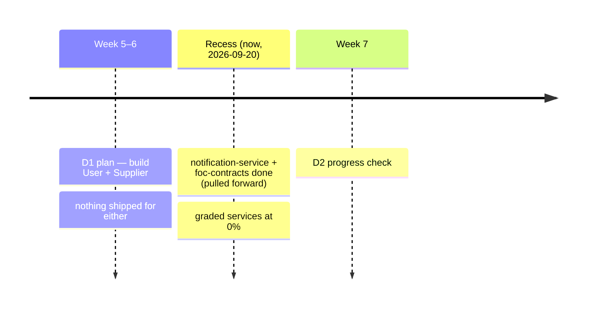
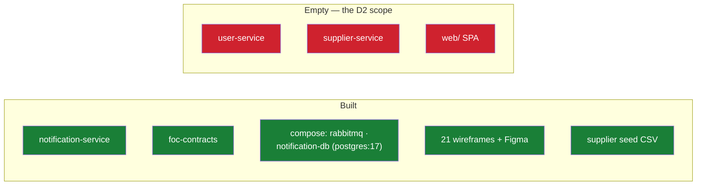
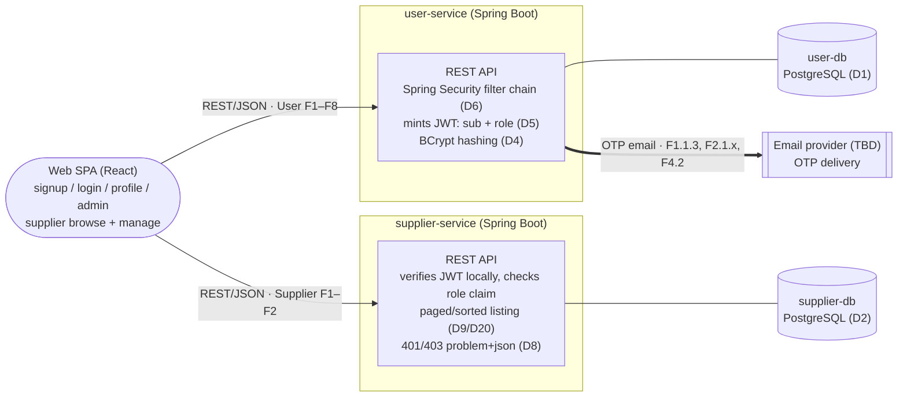
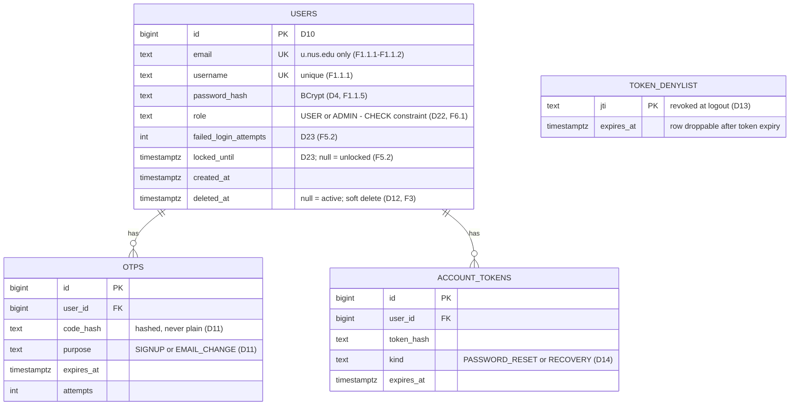
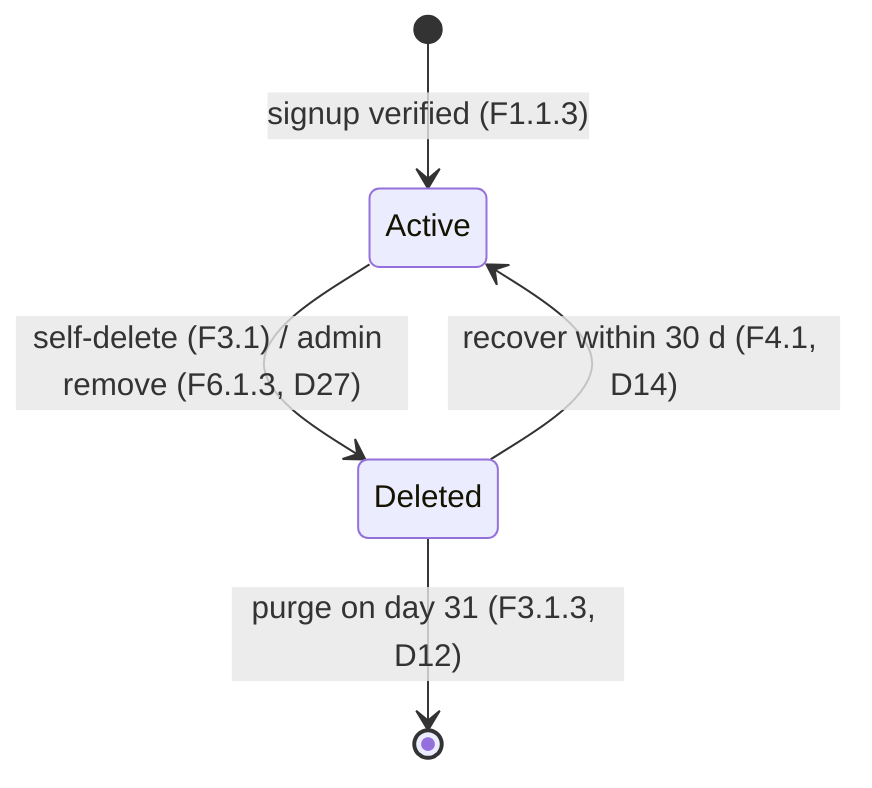
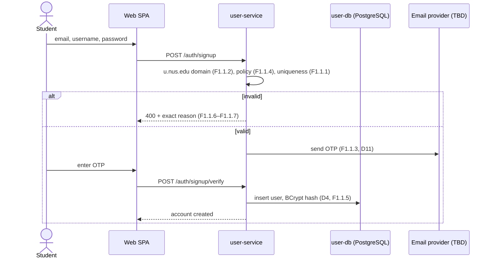
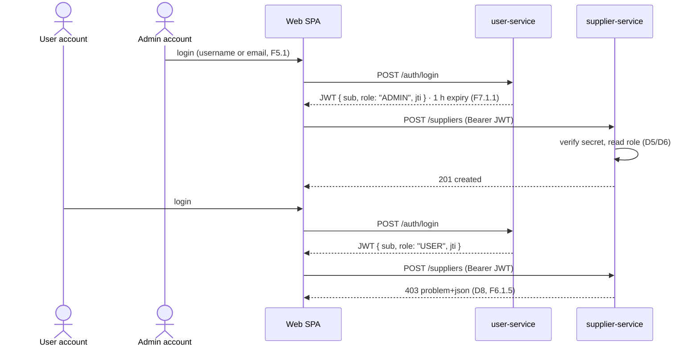
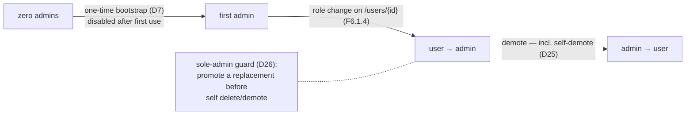
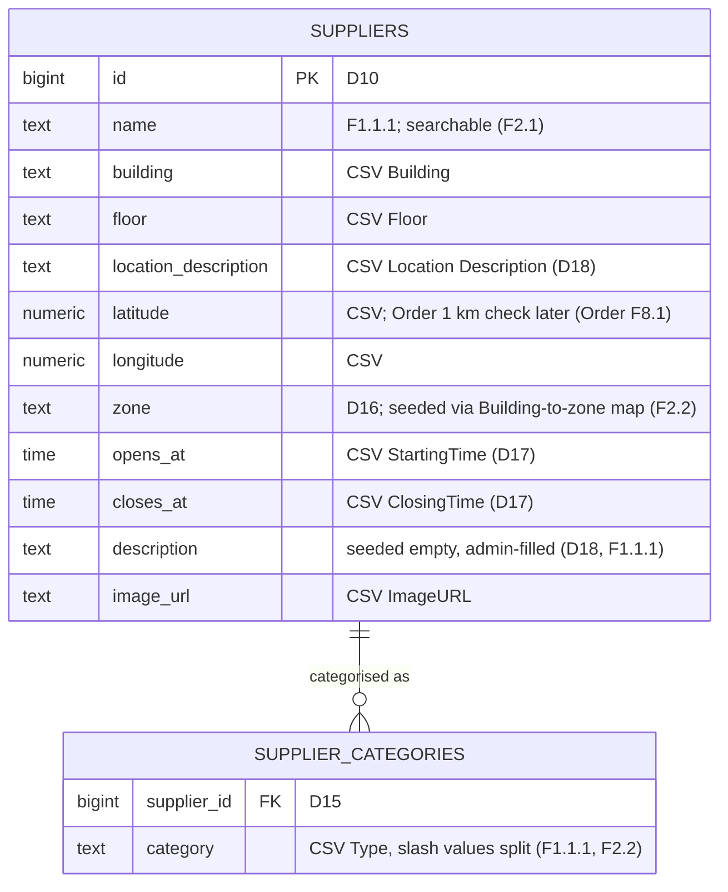

<!--
  AI-assisted (CS3219 AI Usage Policy disclosure):
  Tool: Claude Code (Fable 5), 2026-09-20.
  Scope: D2 design document. The tool compiled status/traceability
  from repo/issue state, transcribed the role matrix and
  schema/endpoint content from the D1 backlog plus the decisions
  below, and drew the diagrams from docs/architecture.md plus those
  decisions. Every design decision (D1-D29) was made by Leong Wei
  Zhi on 2026-09-20 via neutral-options Q&As (logged in
  ai/usage-log.md). Per author request the Open-items section was
  replaced by per-section option comparisons; the comparison tables
  list factual properties only — the author's request for
  tool-authored recommendations/justifications was declined under
  this policy, and the author chose instead. Two comparisons (OTP
  email provider, signup-OTP timing) were left unchosen by the
  author and appear without a chosen column. Entity fields and
  endpoints are mechanical derivations from requirements + decisions
  (docs/credit-service.md pattern).
  No requirements, architecture, or trade-off decisions were made by
  the tool.
  Reviewed by: Leong Wei Zhi (via pull request).
-->

# Technical Solution — D2 Design — User & Supplier Services

## Background

- **GitHub issues:** User [#1–#9](https://github.com/AY2627S1-CS3219-P23/foc/issues/1) + #32–#35 · Supplier #10–#11 + #36–#37 · UI #43
- **Design doc:** [architecture.md](architecture.md)
- **Figma:** [Backlog Mockup](https://www.figma.com/design/HZ25RDhbcsBycXG7K7xrFf/Backlog-Mockup?m=auto&t=jQwFXEoz5ucD66x4-6) · [`web/docs/wireframes/`](../web/docs/wireframes/)
- **Requirements:** User F1–F8 + NFR1–4 · Supplier F1–F2 + NFR1–2 · UI NFR1 (D1 backlog)
- **Decisions:** D1–D29 (below) · JWT `sub` convention (issue #67) · foc-contracts D15 ([notification-service.md](notification-service.md))
- **Participants:**
    - **User Service owner:** Kwey Xiu Xi
    - **Supplier Service owner:** Alastair Tan Choon Wei
    - **Frontend:** per-domain owners ([`web/AGENTS.md`](../web/AGENTS.md))
    - **Author/scribe:** Leong Wei Zhi
- **References:** CS3219-Instructions-MilestoneD2.pdf · D1 document (Template-7) · [credit-service.md](credit-service.md) · `AGENTS.md` (M1–M7, deadlines, AI policy)

## Overview

Design answers to the eleven D2 questions (Part 1 §1–6 User Service, Part 2 §1–5 Supplier Service), on top of an honest status snapshot. D2 itself: Week 7, 20–30 min, one service **near-complete**, the other **significant progress** (target per D3: User near-complete), live demo.



> 🔴 `user-service/` and `supplier-service/`: three 0-byte files each. `web/`: wireframes only. All 18 D2 issues open, zero linked PRs. Verified 2026-09-20 — commands in [Testing](#testing).



### Backlog status

Every row: **Not started**. Weeks 5–6 have passed.

| Service | Groups (issue) | Planned |
| --- | --- | --- |
| User | F1 signup+OTP (#1) · F2 update (#2) · F3 delete (#3) · F4 recovery (#4) · F5 login+lockout (#5) · F6 roles/admin (#6) · F7 sessions (#8) · F8 profile (#9) · NFR1 hashing (#32) · NFR4 integrity (#35) | Weeks 5–6 |
| User, later by plan | F6.2 owner (#7) Week 11 · NFR2 60k (#33), NFR3 2 s (#34) Week 12 | Weeks 11–12 |
| Supplier | F1 CRUD+browse (#10) · F2 search/filter (#11) · NFR1 ≤5 s listings (#36) · NFR2 100k (#37) | Weeks 5–6 |
| Supplier, later by plan | NFR1.1.1 caching (#36) | Week 11 |
| UI | NFR1 responsive (#43) | Week 6 |

## Design decisions (made by the team)

All by **Leong Wei Zhi, 2026-09-20**, from neutral-options Q&As (`ai/usage-log.md`); owners review via this PR. Per-document D-series. Option comparisons sit beside each decision in Parts 1–2.

| # | Concern | Decision | Serves |
| --- | --- | --- | --- |
| D1 | User DB | **PostgreSQL** — engine already in repo (`notification-db`) | F1–F8; NFR2/4 |
| D2 | Supplier DB | **PostgreSQL** — same grounds | F1–F2; NFR2 |
| D3 | D2 target | **User near-complete · Supplier significant** | scoping |
| D4 | Hashing | **BCrypt** — NFR1.1's "or equivalent" clause | F1.1.5; NFR1.1 |
| D5 | Role in token | **single `role` claim** beside `sub`; read locally, no callback | F6.1.5; P1.3–4 |
| D6 | RBAC mechanism | **Spring Security filter chain** (`spring-boot-starter-security`) | F6.1.2–5; P1.3 |
| D7 | First admin | **one-time bootstrap endpoint/flag** — active only while zero admins exist | P1.6 |
| D8 | Denied requests | **RFC 9457 problem+json** — 401 no/invalid token, 403 wrong role | F6.1.5; P2.2 |
| D9 | Paging/sorting | **adopted as requirement** (absent from backlog) — Spring Data `Pageable`; issue to file | P2.2/2.5 |
| D10 | Primary keys | **DB identity (bigint)** for both services' tables | schema |
| D11 | OTP storage | **dedicated `otps` table** — user ref, hashed code, purpose, expiry, attempts | F1.1.3, F2.1.1, F2.1.3 |
| D12 | Deletion + 30-day block | **soft delete on `users`** (`deleted_at`); row keeps the unique email/username for 30 days = the block; purge day 31; recovery clears the flag | F3.1.1–F3.1.3, F4.1 |
| D13 | Logout invalidation | **server-side denylist** — revoked `jti` kept until natural expiry | F7.1.2 |
| D14 | Reset/recovery tokens | **separate token table** — longer-lived link tokens, distinct from OTP codes | F4.1, F4.2 |
| D15 | Supplier categories | **join table `supplier_categories`** — CSV `Type` seeds rows, slash values split | Supplier F1.1.1, F2.2 |
| D16 | Campus zone | **`zone` column**, seeded via a team-written Building→zone mapping | Supplier F2.2 |
| D17 | Opening times | **`opens_at` / `closes_at` TIME columns** — single daily window, matches CSV | Supplier F1.1.1 |
| D18 | Description | **column seeded empty; admins fill in-app**; CSV `Location Description` stays its own field | Supplier F1.1.1 |
| D19 | URL style | **unprefixed resource roots** (`/suppliers`, `/auth/…`, `/users/…`) | P1.3, P2.2 |
| D20 | Supplier querying | **one `GET /suppliers`** with optional `name`, `category`, `zone` + `Pageable` params | F1.2, F2.1, F2.2, D9 |
| D21 | User route grouping | **`/auth/*` flows · `/users/me` own account · `GET /users/{id}` public · admin ops on `/users/*` role-gated** | F1–F8 surface |
| D22 | Role storage | **`role` column + CHECK** (USER/ADMIN/OWNER) on `users` | F6.1; P1 §2 |
| D23 | Lockout fields | **counters on `users`** — `failed_login_attempts`, `locked_until` | F5.2–F5.2.1 |
| D24 | Protected fields | **allow-list DTOs** — update endpoints accept only editable fields | F2; P1 §5 |
| D25 | Admin self-revocation | **allowed unless last admin** | P1 §6 |
| D26 | Last-admin guard | **promote a replacement first** before the sole admin can delete/demote themselves | P1 §6 |
| D27 | Admin account removal | **same soft-delete path as F3** (D12: 30-day block, recovery, day-31 purge) | F6.1.3 |
| D28 | Sign-up credit call | **not wired yet** — Credit F1.1 provisioning added when credit-service exists | sign-up scope |
| D29 | Supplier caching | **shared cache** (external store, e.g. a Redis container) — Week 11 work | NFR1.1.1 |

> ✍️ "Why" answers at the check come from the deciders — the AI policy bars tool-written rationales, so the comparisons below list factual properties only. Two comparisons were left unchosen by the team (OTP email provider, signup-OTP timing — both in Part 1 §3).

## Architecture (D2 slice)

From [architecture.md](architecture.md) + decisions. No gateway — each service verifies the HS256 `JWT_SECRET` locally. **Diagram source:** [`d2-design.mmd`](d2-design.mmd).



> ✍️ Endpoint paths below are the D19/D21-decided grouping; exact verbs/nesting are the owner's to finalize.

**Sign-up × Credit Service** — architecture.md routes sign-up through Credit F1.1 (5 starting credits); `credit-service/` is a stub today. Behaviour until it exists (chosen: D28):

|   | Don't call yet (chosen — D28) | Call, tolerate failure | Call, fail sign-up |
| --- | --- | --- | --- |
| Sign-up works with the stub | yes | yes | no |
| Credit F1.1 at D2 | deferred with credit-service | attempted; provision later | blocked |

## Part 1 — User Service

### §1 Role design

Roles transcribed from backlog F6/F8 — two tiers now, owner later; **requester/courier are modes of `user`, not roles** (one account does both without re-login, F6.1.1). This matrix is the artifact the rubric asks the team to keep updated.

| Role | Obtained | Can do |
| --- | --- | --- |
| **user** (default) | sign-up (F1.1) | requester + courier modes (F6.1.1) · own account F2–F4 · own profile F8.1 · public profiles F8.1.1 · unpermitted actions rejected with message (F6.1.5) |
| **admin** | promotion (F6.1.4); first via bootstrap (D7) | user + list all (F6.1.2) · remove accounts (F6.1.3) · promote/demote (F6.1.4) · supplier CRUD (Supplier F1.1) |
| **owner** (Week 11, Low) | first registrant (F6.2.1) | admin-equivalent (F6.2.2) · exactly one, transfer before delete (F6.2.3) · not editable by admins (F6.2.4) |

### §2 Database & schema

PostgreSQL (D1), Spring Data JPA (stack), bigint identity keys (D10). Fields ← requirements/decisions (credit-service.md discipline):



- **Credential storage:** only the BCrypt hash is stored (D4, F1.1.5, NFR1.1); OTP codes and reset tokens stored hashed (D11/D14); `JWT_SECRET` lives in env, never the DB.
- **Soft delete = reuse block:** the deleted row keeps occupying the unique email/username for 30 days (F3.1.2); purge on day 31 (F3.1.3, scheduler); recovery clears `deleted_at` (F4.1).

**Role storage** (chosen: D22):

|   | `role` column + CHECK (chosen — D22) | PostgreSQL enum type | `roles` join table |
| --- | --- | --- | --- |
| Extra table | no | no | yes |
| Multi-role capable | no | no | yes |
| Add a role value | CHECK migration | ALTER TYPE migration | insert a row |

**Lockout representation** (chosen: D23):

|   | Counters on `users` (chosen — D23) | `login_attempts` table |
| --- | --- | --- |
| Extra table | no | yes |
| Per-attempt audit trail | no | yes |
| Reset on success (F5.2.1) | clear two columns | nothing — computed from rows |



### §3 Authentication & authorization

Token-based: user-service mints an HS256 JWT on login with the shared `JWT_SECRET` (architecture.md auth note); every service verifies locally — no gateway, no identity provider.

| Claim | Value | Source |
| --- | --- | --- |
| `sub` | platform user id | issue #67 convention |
| `role` | `USER` / `ADMIN` | D5 |
| `jti` | token id — denylist key at logout | D13 |
| `exp` | 1 hour after issue | F7.1.1 |

Enforcement: Spring Security filter chain (D6) validates the JWT and maps `role` to authorities; rules per route; violations → problem+json 401/403 (D8). Login accepts username-or-email (F5.1), failures non-revealing (F5.1.1); lockout 15 min after 5 consecutive failures via the `users` counters (F5.2, D23), cleared on success (F5.2.1). Logout denylists the token's `jti` until expiry (D13, F7.1.2).



**Signup-OTP timing** — when does the user row exist? (unchosen; the sequence above draws the insert-after shape; owner picks in the implementation PR):

|   | Row before verify | Insert after verify |
| --- | --- | --- |
| `users` needs a verified flag | yes | no |
| Signup OTP row references | user id | email |
| Unverified signups hold the unique email/username | yes | no |

**OTP email provider** (unchosen; blocks the #1–#4 email flows; owner picks — the MAIL node stays TBD until then):

|   | Gmail SMTP | Transactional email API | AWS SES |
| --- | --- | --- | --- |
| Account needed | Google + app password | provider + API key | AWS |
| Integration | spring-boot-starter-mail | provider SDK / HTTP | SES SDK or SMTP |
| Sending constraints | Gmail daily limits | free-tier quotas | sandbox until prod access |

Route surface (D19/D21):

| Route | Purpose | Access |
| --- | --- | --- |
| `POST /auth/signup` → `POST /auth/signup/verify` | create account via OTP (F1.1, F1.1.3) | public |
| `POST /auth/login` | username-or-email + password → JWT (F5.1) | public |
| `POST /auth/logout` | denylist current `jti` (F7.1.2, D13) | bearer |
| `POST /auth/password-reset` (+ confirm) | emailed token (F4.2, D14) | public |
| `POST /auth/recover` | restore deleted account ≤30 d (F4.1, D14) | public |
| `GET /users/me` · `PATCH /users/me` · `DELETE /users/me` | own profile / OTP-confirmed updates / soft delete (F8.1, F2, F3.1) | bearer |
| `GET /users/{id}` | public profile, username only (F8.1.1) | bearer |
| `GET /users` · `DELETE /users/{id}` · role change on `/users/{id}` | admin list / remove / promote-demote (F6.1.2–F6.1.4) | admin |
| bootstrap route/flag | first admin, active only at zero admins (D7) | see D7 |

### §4 Integration with the Supplier Service

Same token, verified independently by each service; supplier-service reads `role` from the claim (D5) — no runtime call to user-service. The verifier half already exists as real code — [`JwtVerifier`](../notification-service/src/main/java/foc/notification/security/JwtVerifier.java), which minted tokens must pass and supplier-side checks can mirror:

```java
public String verifiedSubject(String token) {
    Jws<Claims> jws = parser.parseSignedClaims(token);
    // Defense in depth: the platform convention is HS256 exactly.
    // (The signature was already verified against the shared key.)
    if (!"HS256".equals(jws.getHeader().getAlgorithm())) {
        throw new MalformedJwtException("unexpected signature algorithm");
    }
    String subject = jws.getPayload().getSubject();
    if (subject == null || subject.isBlank()) {
        throw new MalformedJwtException("token has no subject");
    }
    return subject;
}
```

Built eagerly: missing/short `JWT_SECRET` fails startup (`MIN_SECRET_BYTES = 32`).



### §5 User profile management

Updates validated like signup: uniqueness re-check (F2.1.2), OTP to the existing email before change (F2.1.1), new email confirmed by OTP (F2.1.3), double-entry + policy re-check for passwords (F2.1.4–F2.1.5) — all via the `otps` table (D11).

**Protected fields** — role, account status, user id (chosen: D24):

|   | Allow-list DTOs (chosen — D24) | Reject if present | Ignore silently |
| --- | --- | --- | --- |
| Protected fields in the request shape | absent | possible | possible |
| Tampering surfaced to caller | n/a — not expressible | 400 problem+json | no |
| Binding behaviour | only editable fields bound | request rejected | fields dropped |

With D24, `PATCH /users/me` accepts only email/username/password — a request carrying `role` has no field to land in.

### §6 Role lifecycle & administration



- First admin: bootstrap path active **only while zero admins exist**, disabled after first use (D7) — controlled, no developer intervention afterwards.
- Promotion/demotion: in-app admin action (F6.1.4) — repeatable without developer involvement.

**Admin self-revocation** (chosen: D25):

|   | Allow unless last (chosen — D25) | Block entirely | Always allow |
| --- | --- | --- | --- |
| Self-demotion possible | yes, unless sole admin | no | yes |
| Zero-admin state reachable | no | no | yes (bootstrap re-arms) |

**Sole admin deletes/demotes themselves** (chosen: D26):

|   | Promote replacement first (chosen — D26) | Block with error | Allow; bootstrap re-arms |
| --- | --- | --- | --- |
| Response while sole admin | requires another admin promoted first | 409/422 problem+json | succeeds |
| Zero-admin window | never | never | until re-bootstrap |
| Parallel in backlog | owner rule F6.2.3 | — | D7 re-arm |

**Admin removes an account (F6.1.3)** (chosen: D27):

|   | Soft-delete like F3 (chosen — D27) | Immediate hard delete | Soft-delete, no recovery |
| --- | --- | --- | --- |
| 30-day identifier block (F3.1.2) | yes | no | yes |
| User-initiated recovery (F4.1) | yes | no | no |
| Purge | day 31 (D12) | immediate | day 31 |

## Part 2 — Supplier Service

### §1 Database & schema

PostgreSQL (D2), bigint identity keys (D10):



Seed mapping ([`data/csv/supplier-seed-data.csv`](../data/csv/supplier-seed-data.csv), 21 rows — course requires seeding from `data/`):

| CSV column | Field | Note |
| --- | --- | --- |
| Name | `name` | — |
| Type | `supplier_categories` rows | `Food/Coffee` → two rows (D15) |
| Building / Floor | `building` / `floor` | zone derived via team's Building→zone map (D16) |
| Location Description | `location_description` | kept as its own field (D18) |
| Latitude / Longitude | `latitude` / `longitude` | — |
| StartingTime / ClosingTime | `opens_at` / `closes_at` | parse `0900hrs` (D17) |
| ImageURL | `image_url` | — |
| — | `description` | seeded empty (D18) |

### §2 Query patterns & API design

Key queries: browse all, fetch by id, search by name, filter by category and zone — all paged and sortable (D9). One list endpoint serves them (D20):

| Route | Purpose | Access |
| --- | --- | --- |
| `GET /suppliers?name=&category=&zone=&page=&size=&sort=` | browse / search (F2.1) / filter (F2.2) / page+sort (D9); all params optional | bearer, any role |
| `GET /suppliers/{id}` | detail view (F1.2.1) | bearer, any role |
| `POST /suppliers` | create (F1.1.1) | admin |
| `PUT /suppliers/{id}` | update (F1.1.2) | admin |
| `DELETE /suppliers/{id}` | delete (F1.1.3) | admin |

- No match → 200 with an empty page; the UI renders the empty-state message (F2.2.1).
- Identity/role handling: Bearer JWT verified locally, `role` claim gates the write routes (D5/D6); denied → problem+json (D8):

```json
{
  "type": "about:blank",
  "title": "Forbidden",
  "status": 403,
  "detail": "...",
  "instance": "/suppliers"
}
```

401 for missing/invalid token; the `detail` member carries F6.1.5's "you lack permission" message.

**Listing cache** — NFR1.1.1, scheduled Week 11 (chosen: D29):

|   | Shared cache (chosen — D29) | In-process cache |
| --- | --- | --- |
| Extra infrastructure | yes — cache container in compose | no |
| Survives service restart | yes | no |

### §3 CRUD independent of the UI

Backend-only service: all functionality above is exposed via the REST API and demoable with curl/HTTP files while the UI is stopped (demo step 6).

### §4 End-to-end integration

Covered by the [§4 sequence](#4-integration-with-the-supplier-service): authenticated login → Bearer call → role check → DB, with admin and non-admin outcomes diverging (201 vs 403).

### §5 Responsive supplier-management UI

- Screens already designed: [`suppliers.png`](../web/docs/wireframes/suppliers.png) (search, category + zone filters, detail panel, empty state) and [`add-edit-supplier.png`](../web/docs/wireframes/add-edit-supplier.png) (admin form + delete confirm); desktop + mobile variants side-by-side per wireframe.
- Must run on **live API data — the rubric forbids mocks**; responsive across widths (UI NFR1, M1).
- Workflows to show: create/edit/delete (admin), view list + details, search, filter + sort, paginate (D9/D20) — not limited to admin screens.

## Demo script (20–30 min)

| # | Rubric | Show |
| --- | --- | --- |
| 1 | P1.1 | role matrix + live roles |
| 2 | P1.2 | `user-db` schema; a BCrypt-hashed row |
| 3 | P1.3 | login → decoded JWT (`sub`, `role`, `jti`, `exp`); endpoint with/without token; logout kills the token (D13) |
| 4 | P1.6 | bootstrap first admin (D7); promote in-app; edge-case answers (D25–D27) |
| 5 | P1.5 | update carrying `role` has no effect — allow-list DTO (D24) |
| 6 | P2.1–3 | supplier CRUD/search/filter/page via curl, UI stopped; rows seeded per the mapping table |
| 7 | P1.4 + P2.4 | admin token works on supplier-service; user token → 403 problem+json |
| 8 | P2.5 | supplier pages at desktop + mobile widths, live data |
| 9 | wrap | diagrams + "why" answers from the deciders |

## Testing

Testable today: this doc's claims, and the existing stack. Per-service run-books arrive with owners' PRs (pattern: [`notification-service/README.md`](../notification-service/README.md); Testcontainers, auto-skip without Docker).

### Reproduce the status audit

```sh
# graded services: 6 files, all 0 bytes
git ls-files user-service supplier-service | xargs ls -la

# no signup/domain code anywhere
grep -rn "u.nus.edu" --include="*.java" .   # no output

# D2 issues all open (#1–#11, #32–#37, #43)
gh issue list --state open --limit 60
```

### Run what exists

```sh
(cd foc-contracts && ./mvnw install)          # one-time (D15, notification doc)
(cd notification-service && ./mvnw test)      # H2, no infra

# cp .env.example .env; set NOTIFICATION_DB_PASSWORD,
# RABBITMQ_PASSWORD, JWT_SECRET (≥32 bytes)
docker compose up --build notification-service
```

Health: `GET http://localhost:${NOTIFICATION_SERVICE_PORT:-8085}/actuator/health`.

## Follow Up

- Two comparisons left unchosen (**OTP email provider**, **signup-OTP timing** — Part 1 §3): owner picks in the implementation PR; the doc's chosen markers get added then.
- File the D9 paging/sorting issue (`service:` / `priority:` / `sprint:` labels).
- Write the Building→zone mapping used at seed time (D16).
- `user-db` / `supplier-db`: compose rows, `.env.example` vars, `AGENTS.md` port-table rows — each owner's own PR (the D29 cache container joins compose with the Week-11 work).
- `docs/user-service.md` / `docs/supplier-service.md` (+ `.mmd`): long-term homes; the D-series here migrates there.
- architecture.md: strike the two resolved engine TBDs after merge.
- No CI yet (`.github/` absent; N5.2 planned Recess) — demo runs on local compose.
- Refresh the status sections after each merged PR.
