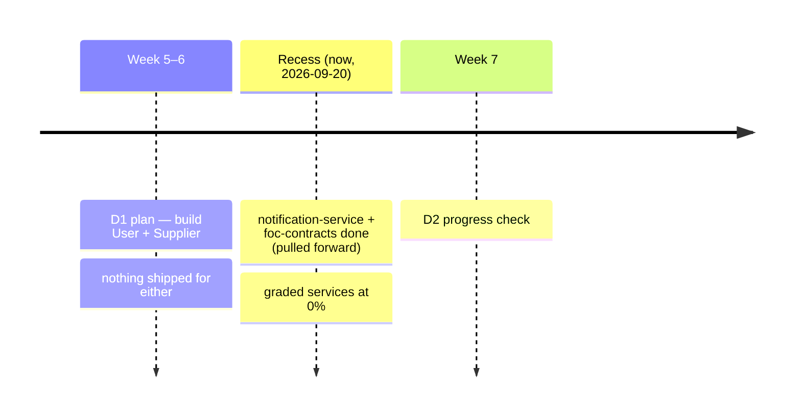
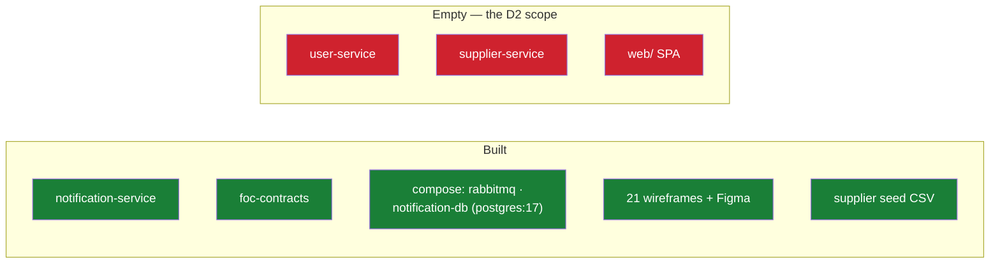
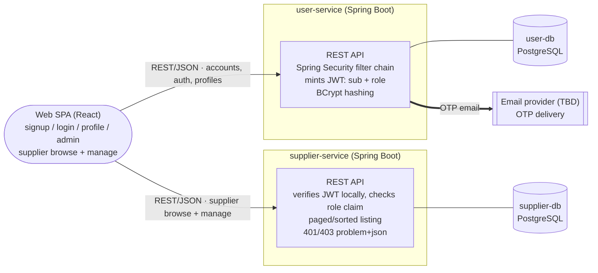
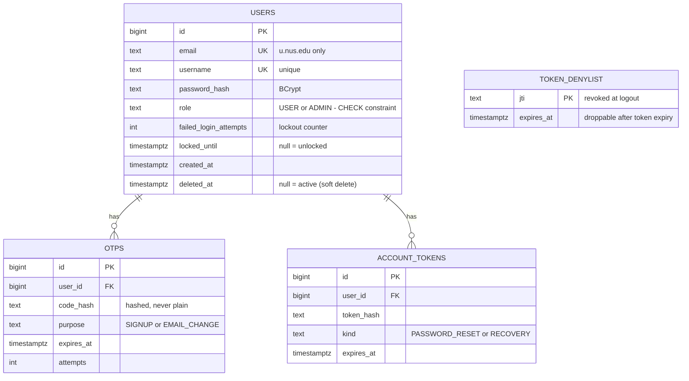
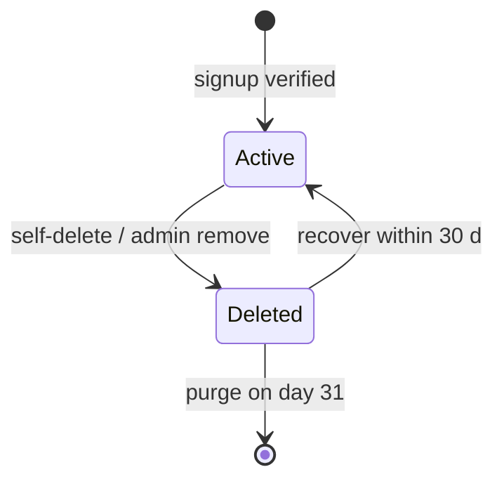
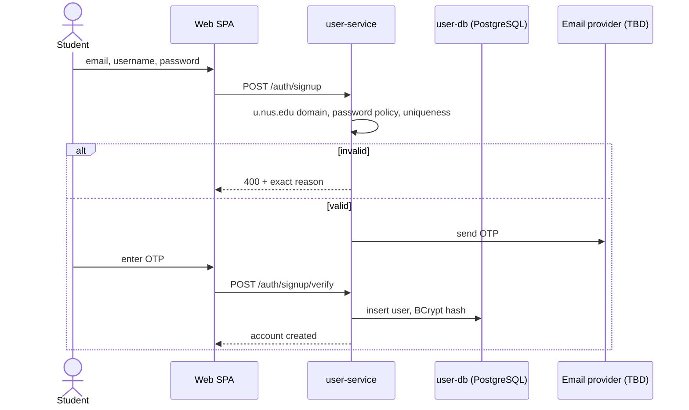
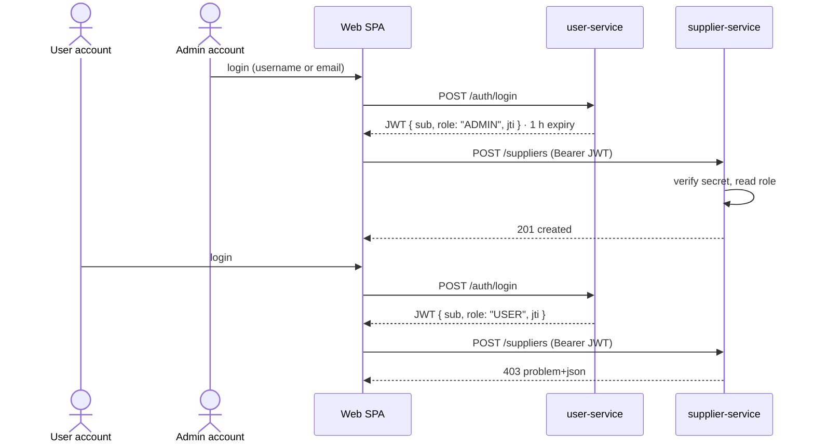
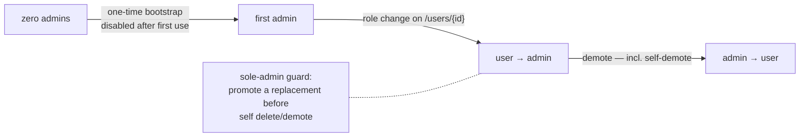
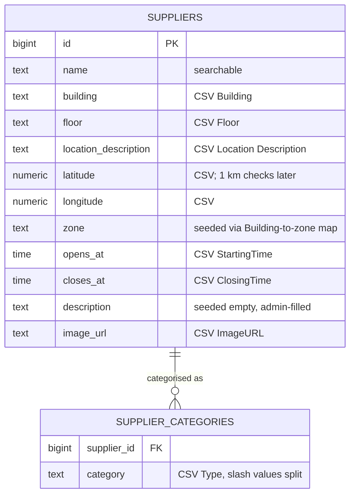

<!--
  AI-assisted (CS3219 AI Usage Policy disclosure):
  Tool: Claude Code (Fable 5), 2026-09-20.
  Scope: D2 design document. The tool compiled status/traceability
  from repo/issue state, transcribed the role matrix and
  schema/endpoint content from the D1 backlog plus team decisions,
  and drew the diagrams from docs/architecture.md plus those
  decisions. All 29 design decisions embedded below (every choice
  marked "(chosen)") were made by Leong Wei Zhi on 2026-09-20 via
  neutral-options Q&As; the full decision list with the tabled
  options is recorded in ai/usage-log.md. The author's request for
  tool-authored recommendations/justifications was declined under
  this policy; comparisons list factual properties only. Two
  comparisons (OTP email provider, signup-OTP timing) are unchosen.
  Same-day revision at author request: requirement/decision
  reference codes and the decisions table removed from the body for
  readability — attribution and traceability live in this header and
  ai/usage-log.md; the Lark internal-discussion copy carries no
  disclosure banner (all disclosures remain in-repo).
  No requirements, architecture, or trade-off decisions were made by
  the tool.
  Reviewed by: Leong Wei Zhi (via pull request).
-->

# Technical Solution — D2 Design — User & Supplier Services

## Background

- **GitHub issues:** User [#1–#9](https://github.com/AY2627S1-CS3219-P23/foc/issues/1) + #32–#35 · Supplier #10–#11 + #36–#37 · UI #43
- **Design doc:** [architecture.md](architecture.md)
- **Figma:** [Backlog Mockup](https://www.figma.com/design/HZ25RDhbcsBycXG7K7xrFf/Backlog-Mockup?m=auto&t=jQwFXEoz5ucD66x4-6) · [`web/docs/wireframes/`](../web/docs/wireframes/)
- **Participants:**
    - **User Service owner:** Kwey Xiu Xi
    - **Supplier Service owner:** Alastair Tan Choon Wei
    - **Frontend:** per-domain owners ([`web/AGENTS.md`](../web/AGENTS.md))
    - **Author/scribe:** Leong Wei Zhi
- **References:** CS3219-Instructions-MilestoneD2.pdf · D1 document · [credit-service.md](credit-service.md) · `AGENTS.md`

## Overview

Design answers to the eleven D2 questions (Part 1 §1–6 User Service, Part 2 §1–5 Supplier Service), on top of an honest status snapshot. D2: Week 7, 20–30 min, one service **near-complete**, the other **significant progress** (target: User near-complete), live demo.



> 🔴 `user-service/` and `supplier-service/`: three 0-byte files each. `web/`: wireframes only. All 18 D2 issues open, zero linked PRs. Verified 2026-09-20 — commands in [Testing](#testing).



> ✍️ Everything marked **(chosen)** was decided by the team (2026-09-20, logged in `ai/usage-log.md`); comparison tables list factual properties, and the reasoning is presented live at the check. Two comparisons are still open — OTP email provider and signup-OTP timing (Part 1 §3).

### Backlog status

Every row: **Not started**. Weeks 5–6 have passed.

| Service | Scope (issue) | Planned |
| --- | --- | --- |
| User | signup+OTP (#1) · account update (#2) · deletion (#3) · recovery (#4) · login+lockout (#5) · roles/admin (#6) · sessions (#8) · profile (#9) · password hashing (#32) · integrity (#35) | Weeks 5–6 |
| User, later by plan | owner role (#7) Week 11 · 60k capacity (#33), 2 s ops (#34) Week 12 | Weeks 11–12 |
| Supplier | CRUD+browse (#10) · search/filter (#11) · ≤5 s listings (#36) · 100k capacity (#37) | Weeks 5–6 |
| Supplier, later by plan | listing cache (#36) | Week 11 |
| UI | responsive widths (#43) | Week 6 |

## Architecture (D2 slice)

From [architecture.md](architecture.md) plus the team's choices. No gateway — each service verifies the shared HS256 `JWT_SECRET` locally. **Diagram source:** [`d2-design.mmd`](d2-design.mmd).



> ✍️ Endpoint paths are the agreed grouping; exact verbs/nesting are the owner's to finalize.

**Sign-up × Credit Service** — the system architecture routes sign-up through the Credit Service to allocate 5 starting credits; `credit-service/` is a stub today. Behaviour until it exists:

|   | Don't call yet (chosen) | Call, tolerate failure | Call, fail sign-up |
| --- | --- | --- | --- |
| Sign-up works with the stub | yes | yes | no |
| 5-credit provision at D2 | deferred with credit-service | attempted; provision later | blocked |

## Part 1 — User Service

### §1 Role design

Two tiers now, owner later; **requester/courier are modes of `user`, not roles** — one account does both without re-login. This matrix is the artifact the rubric asks the team to keep updated.

| Role | Obtained | Can do |
| --- | --- | --- |
| **user** (default) | sign-up | requester + courier modes without re-login · manage own account · view own profile (incl. credit balance, role) · view public profiles (username only) · unpermitted actions rejected with a message |
| **admin** | promotion; first via bootstrap | everything a user can, plus: list all users · remove accounts · promote/demote · supplier CRUD |
| **owner** (Week 11, low priority) | first registrant | admin-equivalent · exactly one — ownership transfers before deletion · not editable by other admins |

### §2 Database & schema

PostgreSQL, Spring Data JPA, bigint identity keys:



- **Credential storage:** only the BCrypt hash is stored; OTP codes and reset tokens are stored hashed; `JWT_SECRET` lives in env, never the DB.
- **Soft delete = reuse block:** the deleted row keeps occupying the unique email/username for 30 days; purge on day 31 (scheduler); recovery clears `deleted_at`.

**Role storage** (chosen: column + CHECK):

|   | `role` column + CHECK (chosen) | PostgreSQL enum type | `roles` join table |
| --- | --- | --- | --- |
| Extra table | no | no | yes |
| Multi-role capable | no | no | yes |
| Add a role value | CHECK migration | ALTER TYPE migration | insert a row |

**Lockout representation** (chosen: counters):

|   | Counters on `users` (chosen) | `login_attempts` table |
| --- | --- | --- |
| Extra table | no | yes |
| Per-attempt audit trail | no | yes |
| Reset on success | clear two columns | nothing — computed from rows |



### §3 Authentication & authorization

Token-based: user-service mints an HS256 JWT on login with the shared `JWT_SECRET`; every service verifies locally — no gateway, no identity provider.

| Claim | Value |
| --- | --- |
| `sub` | platform user id |
| `role` | `USER` / `ADMIN` |
| `jti` | token id — denylist key at logout |
| `exp` | 1 hour after issue |

Enforcement: the Spring Security filter chain validates the JWT and maps `role` to authorities; violations → problem+json 401/403. Login accepts username-or-email; failures are non-revealing; lockout 15 min after 5 consecutive failures, counters cleared on success. Logout denylists the token's `jti` until expiry.



**Signup-OTP timing** — when does the user row exist? (open; the sequence above draws the insert-after shape; owner picks in the implementation PR):

|   | Row before verify | Insert after verify |
| --- | --- | --- |
| `users` needs a verified flag | yes | no |
| Signup OTP row references | user id | email |
| Unverified signups hold the unique email/username | yes | no |

**OTP email provider** (open; blocks the email flows; the MAIL node stays TBD until the owner picks):

|   | Gmail SMTP | Transactional email API | AWS SES |
| --- | --- | --- | --- |
| Account needed | Google + app password | provider + API key | AWS |
| Integration | spring-boot-starter-mail | provider SDK / HTTP | SES SDK or SMTP |
| Sending constraints | Gmail daily limits | free-tier quotas | sandbox until prod access |

Route surface:

| Route | Purpose | Access |
| --- | --- | --- |
| `POST /auth/signup` → `POST /auth/signup/verify` | create account via OTP | public |
| `POST /auth/login` | username-or-email + password → JWT | public |
| `POST /auth/logout` | denylist current `jti` | bearer |
| `POST /auth/password-reset` (+ confirm) | reset via emailed token | public |
| `POST /auth/recover` | restore deleted account ≤30 d | public |
| `GET /users/me` · `PATCH /users/me` · `DELETE /users/me` | own profile / OTP-confirmed updates / soft delete | bearer |
| `GET /users/{id}` | public profile (username only) | bearer |
| `GET /users` · `DELETE /users/{id}` · role change on `/users/{id}` | admin list / remove / promote-demote | admin |
| bootstrap route/flag | first admin — active only at zero admins | one-time |

### §4 Integration with the Supplier Service

Same token, verified independently by each service; supplier-service reads `role` from the claim — no runtime call to user-service. The verifier half already exists as real code — [`JwtVerifier`](../notification-service/src/main/java/foc/notification/security/JwtVerifier.java), which minted tokens must pass and supplier-side checks can mirror:

```java
public String verifiedSubject(String token) {
    Jws<Claims> jws = parser.parseSignedClaims(token);
    // Defense in depth: the platform convention is HS256 exactly.
    // (The signature was already verified against the shared key.)
    if (!"HS256".equals(jws.getHeader().getAlgorithm())) {
        throw new MalformedJwtException("unexpected signature algorithm");
    }
    String subject = jws.getPayload().getSubject();
    if (subject == null || subject.isBlank()) {
        throw new MalformedJwtException("token has no subject");
    }
    return subject;
}
```

Built eagerly: a missing or short `JWT_SECRET` fails startup (`MIN_SECRET_BYTES = 32`).



### §5 User profile management

Updates validated like sign-up: uniqueness re-check, OTP to the existing email before any change, new email confirmed by OTP, double-entry + policy re-check for passwords — all via the `otps` table.

**Protected fields** — role, account status, user id (chosen: allow-list DTOs):

|   | Allow-list DTOs (chosen) | Reject if present | Ignore silently |
| --- | --- | --- | --- |
| Protected fields in the request shape | absent | possible | possible |
| Tampering surfaced to caller | n/a — not expressible | 400 problem+json | no |
| Binding behaviour | only editable fields bound | request rejected | fields dropped |

With allow-list DTOs, `PATCH /users/me` accepts only email/username/password — a request carrying `role` has no field to land in.

### §6 Role lifecycle & administration



- First admin: bootstrap path active **only while zero admins exist**, disabled after first use — controlled, no developer intervention afterwards.
- Promotion/demotion: in-app admin action — repeatable without developer involvement.

**Admin self-revocation** (chosen: allow unless last):

|   | Allow unless last (chosen) | Block entirely | Always allow |
| --- | --- | --- | --- |
| Self-demotion possible | yes, unless sole admin | no | yes |
| Zero-admin state reachable | no | no | yes (bootstrap re-arms) |

**Sole admin deletes/demotes themselves** (chosen: promote replacement first):

|   | Promote replacement first (chosen) | Block with error | Allow; bootstrap re-arms |
| --- | --- | --- | --- |
| Response while sole admin | requires another admin promoted first | 409/422 problem+json | succeeds |
| Zero-admin window | never | never | until re-bootstrap |

**Admin removes an account** (chosen: soft-delete, same as self-deletion):

|   | Soft-delete like self-deletion (chosen) | Immediate hard delete | Soft-delete, no recovery |
| --- | --- | --- | --- |
| 30-day identifier block | yes | no | yes |
| User-initiated recovery | yes | no | no |
| Purge | day 31 | immediate | day 31 |

## Part 2 — Supplier Service

### §1 Database & schema

PostgreSQL, bigint identity keys:



Seed mapping ([`data/csv/supplier-seed-data.csv`](../data/csv/supplier-seed-data.csv), 21 rows — the course requires seeding from `data/`):

| CSV column | Field | Note |
| --- | --- | --- |
| Name | `name` | — |
| Type | `supplier_categories` rows | `Food/Coffee` → two rows |
| Building / Floor | `building` / `floor` | zone derived via the team's Building→zone map |
| Location Description | `location_description` | kept as its own field |
| Latitude / Longitude | `latitude` / `longitude` | — |
| StartingTime / ClosingTime | `opens_at` / `closes_at` | parse `0900hrs` |
| ImageURL | `image_url` | — |
| — | `description` | seeded empty |

### §2 Query patterns & API design

Key queries: browse all, fetch by id, search by name, filter by category and zone — all paged and sortable. One list endpoint serves them:

| Route | Purpose | Access |
| --- | --- | --- |
| `GET /suppliers?name=&category=&zone=&page=&size=&sort=` | browse / search / filter / page+sort; all params optional | bearer, any role |
| `GET /suppliers/{id}` | detail view | bearer, any role |
| `POST /suppliers` | create | admin |
| `PUT /suppliers/{id}` | update | admin |
| `DELETE /suppliers/{id}` | delete | admin |

- No match → 200 with an empty page; the UI renders the empty-state message.
- Bearer JWT verified locally; the `role` claim gates the write routes; denied →

```json
{
  "type": "about:blank",
  "title": "Forbidden",
  "status": 403,
  "detail": "...",
  "instance": "/suppliers"
}
```

401 for missing/invalid token; the `detail` member carries the you-lack-permission message.

**Listing cache** — planned for Week 11 (chosen: shared cache):

|   | Shared cache (chosen) | In-process cache |
| --- | --- | --- |
| Extra infrastructure | yes — cache container in compose | no |
| Survives service restart | yes | no |

### §3 CRUD independent of the UI

Backend-only service: everything above is exposed via the REST API and demoable with curl/HTTP files while the UI is stopped (demo step 6).

### §4 End-to-end integration

Covered by the [Part 1 §4 sequence](#4-integration-with-the-supplier-service): authenticated login → Bearer call → role check → DB, with admin and non-admin outcomes diverging (201 vs 403).

### §5 Responsive supplier-management UI

- Screens already designed: [`suppliers.png`](../web/docs/wireframes/suppliers.png) (search, category + zone filters, detail panel, empty state) and [`add-edit-supplier.png`](../web/docs/wireframes/add-edit-supplier.png) (admin form + delete confirm); desktop + mobile variants side-by-side per wireframe.
- Must run on **live API data — the rubric forbids mocks**; responsive across widths.
- Workflows to show: create/edit/delete (admin), view list + details, search, filter + sort, paginate — not limited to admin screens.

## Demo script (20–30 min)

| # | Rubric | Show |
| --- | --- | --- |
| 1 | P1.1 | role matrix + live roles |
| 2 | P1.2 | `user-db` schema; a BCrypt-hashed row |
| 3 | P1.3 | login → decoded JWT (`sub`, `role`, `jti`, `exp`); endpoint with/without token; logout kills the token |
| 4 | P1.6 | bootstrap first admin; promote in-app; edge-case answers |
| 5 | P1.5 | update carrying `role` has no effect — allow-list DTO |
| 6 | P2.1–3 | supplier CRUD/search/filter/page via curl, UI stopped; rows seeded per the mapping table |
| 7 | P1.4 + P2.4 | admin token works on supplier-service; user token → 403 problem+json |
| 8 | P2.5 | supplier pages at desktop + mobile widths, live data |
| 9 | wrap | diagrams + "why" answers from the deciders |

## Testing

Testable today: this doc's claims, and the existing stack. Per-service run-books arrive with owners' PRs (pattern: [`notification-service/README.md`](../notification-service/README.md); Testcontainers, auto-skip without Docker).

### Reproduce the status audit

```sh
# graded services: 6 files, all 0 bytes
git ls-files user-service supplier-service | xargs ls -la

# no signup/domain code anywhere
grep -rn "u.nus.edu" --include="*.java" .   # no output

# D2 issues all open (#1–#11, #32–#37, #43)
gh issue list --state open --limit 60
```

### Run what exists

```sh
(cd foc-contracts && ./mvnw install)          # one-time (shared contracts library)
(cd notification-service && ./mvnw test)      # H2, no infra

# cp .env.example .env; set NOTIFICATION_DB_PASSWORD,
# RABBITMQ_PASSWORD, JWT_SECRET (≥32 bytes)
docker compose up --build notification-service
```

Health: `GET http://localhost:${NOTIFICATION_SERVICE_PORT:-8085}/actuator/health`.

## Follow Up

- Two open comparisons (**OTP email provider**, **signup-OTP timing** — Part 1 §3): owner picks in the implementation PR.
- File the supplier paging/sorting issue (labels per the backlog convention).
- Write the Building→zone mapping used at seed time.
- `user-db` / `supplier-db`: compose rows, `.env.example` vars, `AGENTS.md` port-table rows — each owner's own PR (the cache container joins with the Week-11 work).
- `docs/user-service.md` / `docs/supplier-service.md` (+ `.mmd`): long-term homes for each service's decision record.
- architecture.md: strike the two resolved engine TBDs after merge.
- No CI yet (`.github/` absent) — demo runs on local compose.
- Refresh the status sections after each merged PR.
