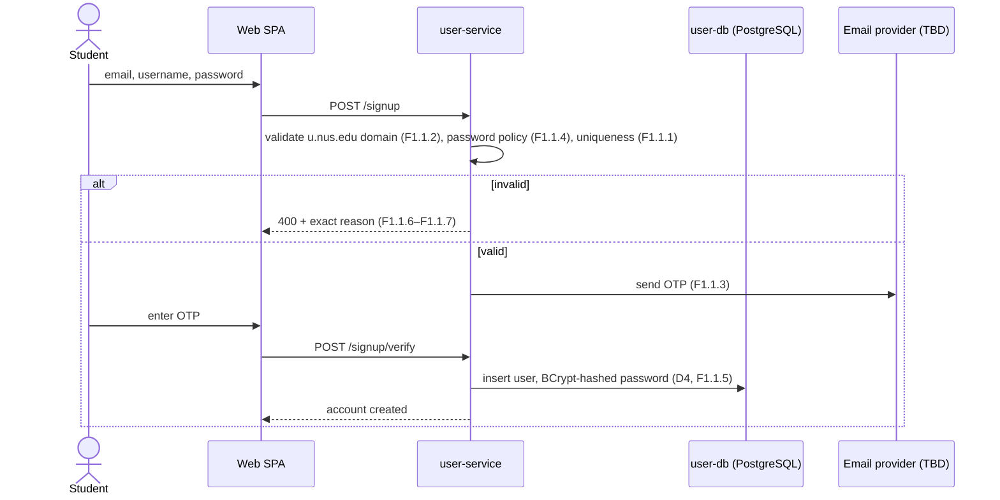
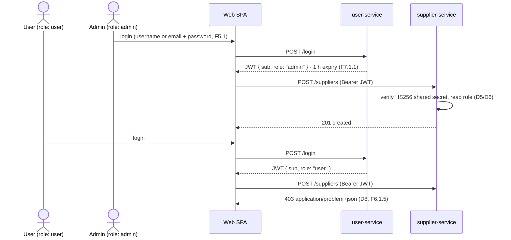

<!--
  AI-assisted (CS3219 AI Usage Policy disclosure):
  Tool: Claude Code (Fable 5), 2026-09-20.
  Scope: D2 progress-check readiness document. The tool compiled the
  status inventory, the D1-backlog traceability tables, and the D2
  rubric gap analysis from the course D2 instructions, the team's D1
  document, and the repository/issue state as of 2026-09-20; it also
  transcribed the role-capability matrix from the D1 backlog and drew
  the target-architecture diagrams strictly from docs/architecture.md
  plus the decisions below. Every design decision in the Decisions
  table (D1-D9) was made by Leong Wei Zhi on 2026-09-20 via
  neutral-options Q&As (logged in ai/usage-log.md); the tool presented
  the options factually and transcribed the outcomes. Decisions the
  author deferred are recorded under Open items with no analysis.
  No requirements, architecture, or trade-off decisions were made by
  the tool.
  Reviewed by: Leong Wei Zhi (via pull request).
-->

# Technical Solution — D2 Progress-Check Readiness — User & Supplier Services

## Background

- **GitHub issues:** User Service [#1–#9](https://github.com/AY2627S1-CS3219-P23/foc/issues/1) (F1–F8, F6.2) and #32–#35 (NFR1–4) · Supplier Service #10–#11 (F1–F2) and #36–#37 (NFR1–2) · Overall UI #43 (NFR1)
- **Design doc:** [architecture.md](architecture.md) (system-level; authentication note and open-decision list)
- **Figma:** [Backlog Mockup](https://www.figma.com/design/HZ25RDhbcsBycXG7K7xrFf/Backlog-Mockup?m=auto&t=jQwFXEoz5ucD66x4-6) · snapshots in [`web/docs/wireframes/`](../web/docs/wireframes/)
- **Requirements:** D1 backlog — User F1–F8 + NFR1–4, Supplier F1–F2 + NFR1–2, Overall UI NFR1
- **Decisions:** D1–D9 (this document, per-document series); prior relevant: JWT `sub`-claim convention (issue #67, recorded in [architecture.md](architecture.md)), foc-contracts D15 ([notification-service.md](notification-service.md))
- **Participants:**
    - **User Service owner:** Kwey Xiu Xi
    - **Supplier Service owner:** Alastair Tan Choon Wei
    - **Frontend:** per-domain owners ([`web/AGENTS.md`](../web/AGENTS.md) screen mapping)
    - **Author/scribe:** Leong Wei Zhi
- **References:** CS3219-Instructions-MilestoneD2.pdf (course material), CS3219 Team 23 D1 document (Template-7), [notification-service.md](notification-service.md) and [credit-service.md](credit-service.md) (house decision-log convention), `AGENTS.md` (course constraints M1–M7, deadlines, AI policy)

## Overview

Milestone D2 (Week 7, 20–30 min) is an early progress check: the mentor expects a **near-complete implementation of at least one of User Service or Supplier Service, and significant progress on the other**, demonstrated live with supporting diagrams and reasoned design decisions. The `AGENTS.md` deadline note additionally names a **supplier-listing page demo** for D2.

As of 2026-09-20 (recess week), neither graded service has any implementation: `user-service/` and `supplier-service/` are empty scaffolds, and `web/` has no project yet. The team's delivered work so far — `notification-service`, `foc-contracts`, the compose stack, and the JWT verification groundwork — is Recess-week backlog pulled forward. This document is the readiness pack for D2: an honest status baseline against the D1 backlog, a gap analysis against the D2 rubric, the design decisions taken to unblock implementation (D1–D9 below), the open decisions still owned by the team, and an execution/demo plan for the check itself.

## Where we stand — D1 backlog vs actual

> 🔴 **Both graded services are unstarted.** `user-service/` and `supplier-service/` each contain exactly three 0-byte files (`AGENTS.md`, `Dockerfile`, `README.md`) from the 2026-09-10 repo scaffold. Verified 2026-09-20 by repo-wide search: no `pom.xml`, no entities/controllers, no Spring Security dependency, zero hits for `u.nus.edu`, `PasswordEncoder`, or `UserController` outside this document. All 18 D2-relevant issues (#1–#11, #32–#37, #43) are open with no linked PRs.

### Assets already in place

Work that D2 implementation can build on directly:

| Asset | Where | Relevance to D2 |
| --- | --- | --- |
| **JWT verification reference** | [`JwtVerifier.java`](../notification-service/src/main/java/foc/notification/security/JwtVerifier.java) (jjwt, HS256, enforces `sub`, rejects non-HS256, fails fast on short secrets) + `JwtVerifierTest` | The verifier side of the shared-secret scheme every service reuses; the User Service must mint tokens it accepts |
| **JWT env contract** | `.env.example` — `JWT_SECRET` (≥32 bytes, HS256), `JWT_ACCESS_TOKEN_TTL`, `JWT_REFRESH_TOKEN_TTL` | Token config slots already reserved; comment records "the user service will issue tokens with it" |
| **`sub`-claim convention** | Issue #67 / [architecture.md](architecture.md) authentication note | JWT `sub` = platform user ID; the User Service must mint accordingly |
| **Compose stack** | `compose.yaml` — `notification-service`, `rabbitmq`, `notification-db` (postgres:17, loopback-only host port) | Pattern to copy for `user-db` / `supplier-db` (per-service DB rows are added by each owner's PR — `AGENTS.md` port table) |
| **Wireframes** | 21 PNGs in [`web/docs/wireframes/`](../web/docs/wireframes/) + Figma | D2 screens already designed: `signup.png`, `login.png`, `suppliers.png`, `add-edit-supplier.png`, `admin-dashboard.png`, `profile.png`, `public-profile.png`, `forgot-password.png`, `account-recovery.png` |
| **Supplier seed data** | [`data/csv/supplier-seed-data.csv`](../data/csv/supplier-seed-data.csv) — 21 rows: `Name, Type, Building, Floor, Location Description, Latitude, Longitude, StartingTime, ClosingTime, ImageURL` (+ images in `data/images/`) | Course requires seeding the Supplier Service from `data/` (M-scope note in `AGENTS.md`); column mapping is an Open item |
| **Requirement tracker** | Issues #1–#43, labelled `service:` / `priority:` / `sprint:` | The backlog is fully transcribed; implementation PRs reference issues |
| **Delivered early (Recess items)** | `notification-service` (event pipeline, retry/DLQ, STOMP push, purge), `foc-contracts` (typed request events) — issues #61–#65, #68–#69 closed, PRs #70–#83 merged | Evidence of working conventions (per-service DB, app-declared topology, disclosure practice) but contains **nothing for User/Supplier** |

### User Service traceability

| Req group | Members | Priority | Planned | Status | Evidence |
| --- | --- | --- | --- | --- | --- |
| **F1** account creation (unique email/username, `u.nus.edu` only, OTP validation, password policy 10–50 chars upper/lower/digit, hashed storage, exact rejection reasons) | F1.1, F1.1.1–F1.1.7 | Very High / High | Week 5 (OTP: Week 6) | **Not started** | #1 open |
| **F2** account update (OTP to existing email, uniqueness re-check, new-email OTP, double-entry password, policy re-validation) | F2.1, F2.1.1–F2.1.5 | High / Medium | Week 6 | **Not started** | #2 open |
| **F3** account deletion (confirmation + 30-day warning, 30-day signup block, purge on day 31) | F3.1, F3.1.1–F3.1.3 | High / Medium | Week 6 | **Not started** | #3 open |
| **F4** account recovery (restore within 30 days, password reset via email) | F4.1, F4.2 | High / Medium | Week 6 | **Not started** | #4 open |
| **F5** login (username-or-email, non-revealing failure, 15-min lockout after 5 failures, counter reset) | F5.1, F5.1.1, F5.2, F5.2.1 | Very High / High | Week 5–6 | **Not started** | #5 open |
| **F6** roles (user/admin; requester+courier without re-login; admin list/remove/promote/demote; reject unpermitted actions) | F6.1, F6.1.1–F6.1.5 | Very High / High | Week 5–6 | **Not started** | #6 open |
| **F6.2** owner role (first registrant, admin-equivalent, forced ownership transfer, admins cannot edit owner) | F6.2.1–F6.2.4 | Low | Week 11 | **Not started** (by plan) | #7 open |
| **F7** sessions (token on login, 1-hour expiry, logout invalidates) | F7.1, F7.1.1, F7.1.2 | Very High / High | Week 5–6 | **Not started** | #8 open |
| **F8** profile (own profile incl. credit balance + role; public profile username-only) | F8.1, F8.1.1 | Very High / High | Week 6 | **Not started** | #9 open |
| **NFR1** secure storage (SHA256-or-equivalent hashing) | NFR1.1 | Very High | Week 5 | **Not started** (encoder now decided: D4) | #32 open |
| **NFR2** capacity (60 000 accounts) | NFR2.1 | Medium | Week 12 | Not started | #33 open |
| **NFR3** performance (2 s operations, OTP delivery excluded) | NFR3.1–3.2.4 | High | Week 12 | Not started | #34 open |
| **NFR4** integrity (uniqueness checks before async access) | NFR4.1 | High | Week 6 | **Not started** | #35 open |

### Supplier Service traceability

| Req group | Members | Priority | Planned | Status | Evidence |
| --- | --- | --- | --- | --- | --- |
| **F1** supplier management (admin CRUD with name/location/categories/opening times/description; browse list name+category; detail view) | F1.1, F1.1.1–F1.1.4, F1.2, F1.2.1 | Very High | Week 5–6 | **Not started** | #10 open |
| **F2** search & filtering (by name; by category and campus zone; empty-state message) | F2.1, F2.2, F2.2.1 | High / Medium | Week 6 | **Not started** | #11 open |
| **NFR1** performance (listings ≤5 s; caching on name/location) | NFR1.1, NFR1.1.1 | High / Medium | Week 6 (caching: Week 11) | **Not started** | #36 open |
| **NFR2** capacity (100 000 suppliers) | NFR2.1 | High | Week 6 | **Not started** | #37 open |

### Overall UI traceability

| Req group | Members | Priority | Planned | Status | Evidence |
| --- | --- | --- | --- | --- | --- |
| **NFR1** usability (responsive across mobile and wide-screen widths) | NFR1.1, NFR1.1.1 | Very High | Week 6 | **Not started** — no `web/` project scaffold exists (no `package.json`); wireframes only | #43 open |

> ℹ️ Rows planned for Weeks 5–6 are past their planned sprint entering the recess week. The D1 Gantt chart had M2 (User Service) and M3 (Supplier Service) starting Week 5; D2 falls in Week 7.

## D2 rubric gap analysis

D2 grading cuts, as set by the instructions: **near-complete** User Service = Part 1 points 1–6; **significant progress** = points 1–4. **Near-complete** Supplier Service = Part 2 points 1–5; **significant progress** = points 1–4. Per decision D3 below, the team targets **User Service near-complete + Supplier Service significant progress** (with the supplier-listing page additionally named for the D2 demo in `AGENTS.md`).

### Part 1 — User Service

| # | Rubric asks | D1 backlog coverage | Current state | Needed for the demo |
| --- | --- | --- | --- | --- |
| 1 | Role design: which roles, why, documented capabilities per role (artifact to keep updated) | F6.1 (user/admin; requester/courier as modes), F6.2 (owner, Week 11), F8 (role visible in profile) | Roles defined in backlog only; no capability artifact existed | The [role capability matrix below](#role-design-artifact-rubric-part-1-point-1) — present and keep updating it |
| 2 | Database choice + concrete schema + secure credential storage | NFR1.1 (hashing); engine was an open decision in architecture.md | **Now decided:** PostgreSQL (D1), BCrypt (D4); schema itself is owner work, not yet designed | Schema presented from the implemented entities; show hashed rows in `user-db` |
| 3 | Authentication approach + RBAC enforcement + live demo of both | F5 (login), F7 (tokens, expiry, logout), F6.1.5 (reject unpermitted) | JWT scheme sketched (HS256 shared secret, `sub` claim); **now extended:** `role` claim (D5), Spring Security filter chain (D6); no code | Running service: login issues JWT with `role`; protected endpoint rejects per role |
| 4 | Integration: Supplier Service enforces access via User Service identity/roles | F6.1.5 across services (architecture.md authentication note) | Verification-side reference exists (`JwtVerifier`); supplier side not started | Cross-service demo: same token accepted by both; non-admin blocked from supplier CRUD |
| 5 | Profile-update validation; users cannot modify protected fields (role, status, user ID) | F2 (validated update flows); **no explicit backlog item on protected fields** | Gap flagged; enforcement detail is owner work (Open item) | Show an update request attempting a protected field being rejected |
| 6 | Role lifecycle: first-admin creation, promotion workflow without developer intervention, edge cases (self-revoke; last admin) | F6.1.4 (promote/demote); **first-admin bootstrap and edge-case behaviour absent from backlog** | **Now decided:** one-time setup endpoint/flag for first admin (D7); edge-case behaviours still an Open item | Walk the promotion flow live; state the edge-case answers (team to decide them first) |

### Part 2 — Supplier Service

| # | Rubric asks | D1 backlog coverage | Current state | Needed for the demo |
| --- | --- | --- | --- | --- |
| 1 | Database choice + schema + supplier metadata (name, type, location) storage/querying | F1.1.1 (fields), NFR2 (100k) | **Now decided:** PostgreSQL (D2); schema/seed mapping is owner work (Open item — CSV columns don't match F1.1.1 one-to-one) | Schema presented from implemented entities; seeded rows from `data/csv/` |
| 2 | Query patterns + API endpoints + working calls + role-aware access control with denied responses | F1.2 (browse), F2 (search/filter), F6.1.5 | **Now extended:** paged+sorted listing adopted as a requirement (D9); denied responses standardised as RFC 9457 problem+json (D8); no code | Live API calls: by-id, search, filter, paged list; 401/403 problem+json shown |
| 3 | CRUD backend independent of UI, testable via APIs alone | F1.1.1–F1.1.4 | Not started | curl/HTTP-file demo against the running service, UI stopped |
| 4 | End-to-end: authenticated user → Supplier API → DB; different roles, different access | Architecture.md dependency table (Web → Supplier) | Not started; depends on User Service token minting (D5) | Full flow demo with an admin and a non-admin account |
| 5 | Responsive supplier-management UI (create/edit/delete, view, search, filter+sort, paginate, details) on live data | F1.2, F2, UI NFR1; **pagination/sorting had no backlog row — now added (D9)** | `web/` scaffold absent; wireframes done (`suppliers.png`, `add-edit-supplier.png`) | Supplier pages at desktop + mobile widths on live API data (no mocks — rubric requires it) |

### Role design artifact (rubric Part 1, point 1)

Transcribed from the D1 backlog (F6, F8); this table is the artifact the rubric asks the team to keep updated through to the final presentation.

| Role | How obtained | Capabilities (backlog refs) |
| --- | --- | --- |
| **user** (default) | Sign-up (F1.1) | Acts as **requester and courier without re-login** — these are modes of one role, not separate roles (F6.1, F6.1.1); manages own account (F2–F4), views own profile incl. credit balance and role (F8.1) and others' public profiles (F8.1.1); denied any unpermitted action with an explicit message (F6.1.5) |
| **admin** | Promotion by an admin (F6.1.4); first admin via one-time bootstrap (D7) | Everything a user can do, plus: view all users (F6.1.2), remove user accounts (F6.1.3), promote user↔admin (F6.1.4), supplier CRUD (Supplier F1.1) |
| **owner** (Week 11, Low) | First registrant (F6.2.1) | Admin-equivalent permissions (F6.2.2); always exactly one — ownership must transfer before account deletion (F6.2.3); not editable by other admins (F6.2.4) |

## Design decisions (made by the team)

All decisions below were made by **Leong Wei Zhi on 2026-09-20**, from neutral options presented in a Q&A (logged in `ai/usage-log.md`); they unblock D2 implementation and stand as team decisions subject to the affected service owners' review of this document via pull request. D-numbers are this document's own series (house convention: per-document numbering).

| # | Concern | Decision | Serves |
| --- | --- | --- | --- |
| D1 | User Service DB engine | **PostgreSQL** — the engine already operated in this repo (`notification-db`, postgres:17); access via Spring Data JPA per the decided stack (`AGENTS.md`). Resolves the architecture.md open decision for this service | User F1–F8 storage; NFR2, NFR4 |
| D2 | Supplier Service DB engine | **PostgreSQL** — same grounds; resolves the architecture.md open decision for this service | Supplier F1–F2; NFR2 |
| D3 | D2 grading target | **User Service near-complete (Part 1 points 1–6); Supplier Service significant progress (Part 2 points 1–4)** — plus the supplier-listing page named in `AGENTS.md` for the demo | D2 scoping |
| D4 | Password-hashing encoder | **BCrypt** (`BCryptPasswordEncoder`, spring-security-crypto) — adopted under NFR1.1's "SHA256 **or equivalent**" clause | User F1.1.5; NFR1.1 |
| D5 | Role transport in the token | **Single `role` string claim** in the JWT alongside the established `sub` claim — one role per account matches F6.1's model (requester/courier are modes, not roles); services read the claim locally during verification, no per-request callback | User F6.1.5, F7.1; rubric P1.3–P1.4, P2.2 |
| D6 | RBAC enforcement mechanism | **Spring Security filter chain** (`spring-boot-starter-security`): JWT validated in the chain, role rules via `SecurityFilterChain` / method security — first use of Spring Security in the repo (notification's STOMP interceptor remains as is) | User F6.1.2–F6.1.5; rubric P1.3 |
| D7 | First-admin bootstrap | **One-time setup endpoint/flag**: a bootstrap path enabled only while zero admins exist, disabled after first use — promotion thereafter is the in-app admin flow (F6.1.4), no developer intervention per promotion. The Week-11 owner role (F6.2) is unchanged by this | Rubric P1.6 |
| D8 | Denied-request contract | **RFC 9457 `application/problem+json`** via Spring's `ProblemDetail`: **401** for missing/invalid token, **403** for a role the action does not permit, body carrying the reason — uniform across services | User F6.1.5 ("inform the user that they lack permission"); rubric P2.2 |
| D9 | Supplier pagination & sorting | **Adopted as a requirement** (was absent from the D1 backlog despite the rubric's UI workflow list): the supplier listing endpoint is paged and sortable, Spring Data `Pageable` being the stack's mechanism. Follow-up: file the issue and label it like the rest of the backlog | Rubric P2.2, P2.5; context: NFR2's 100 000-supplier capacity |

> ✍️ The mentor will probe *why* behind each decision (D2 "General Tips"). The factual grounds recorded above are what was on the table when each choice was made; the deciders present their own reasoning at the check. Deferred concerns are in [Open items](#open-items-team-decisions-still-pending) — decide them before the demo where a rubric point depends on one.

## Target architecture for D2

Transcribed from [architecture.md](architecture.md) (authentication note, dependency table) narrowed to the D2 slice, with D1–D9 applied. No API gateway exists — each service verifies the shared-secret HS256 JWT locally (`.env.example`), reading `sub` (user ID, issue #67 convention) and `role` (D5).

> ℹ️ Out of frame but adjacent: architecture.md routes sign-up through **User Service → Credit Service** to allocate 5 starting credits (Credit F1.1). `credit-service/` is an empty stub, so how sign-up behaves without it at D2 is an Open item. The existing notification stack (RabbitMQ, STOMP) is unaffected by this slice.

### Sign-up with OTP (F1.1, F1.1.2–F1.1.5)

### Login → role-checked supplier CRUD (F5, F6.1.5, Supplier F1.1)

## Execution plan to Week 7

Workstreams and their factual dependencies — owners per the README allocation; scheduling within the window stays with the team.

| Workstream | Owner | Issues | Serves rubric | Depends on |
| --- | --- | --- | --- | --- |
| User Service: signup/login/tokens (JWT mint with `sub`+`role`), RBAC chain, admin user management, profile | Kwey Xiu Xi | #1, #5, #6, #8, #9, #32 | P1.1–P1.3, P1.5–P1.6, P2.4 | D1/D4–D7 applied; `user-db` compose row + `.env.example` vars + `AGENTS.md` port-table row (owner's PR, house convention) |
| User Service: update/delete/recovery + OTP flows | Kwey Xiu Xi | #2, #3, #4 | P1.5 (near-complete cut) | **Email provider (Open item)** — OTP-dependent rows blocked until decided |
| Supplier Service: schema + seed load, CRUD, search/filter, paged listing, role checks, problem+json | Alastair Tan | #10, #11, #37, new pagination issue (D9) | P2.1–P2.4 | D2/D5/D8/D9 applied; seed mapping (Open item); role claim minted by User Service for the E2E demo |
| Web: SPA scaffold + auth shell + supplier listing page (desktop & mobile) | per-domain owners (`web/AGENTS.md`) | #43 | P2.5; `AGENTS.md` D2 note (supplier-listing page) | Both services' APIs up; live data only (rubric forbids mocks) |
| Demo assets: seeded demo accounts (admin + user) and suppliers | service owners | — | all live-demo points | Course note: "meaningful users/suppliers for demo data" (`AGENTS.md`) |

> 🔴 **Single hard ordering constraint:** every role-aware demo point (P1.3, P1.4, P2.2, P2.4) needs the User Service to mint `sub`+`role` tokens first. The verifier half already exists as reference code; the supplier side and the web shell can develop against a hand-minted token (same `JWT_SECRET`) until then — that is a stopgap for development, not the demo.

## Demo plan (20–30 min)

| Step | Rubric point | Show | Ready when |
| --- | --- | --- | --- |
| 1 | P1.1 | Role capability matrix (this doc) + roles in the running system | doc merged; roles seeded |
| 2 | P1.2 | `user-db` schema walk-through; a user row with its BCrypt hash | schema implemented |
| 3 | P1.3 | Login → decoded JWT (`sub`, `role`, `exp`); protected endpoint with/without token | #5, #8 done |
| 4 | P1.6 | Bootstrap first admin (one-time flag, D7); promote a user in-app (F6.1.4); state edge-case answers | #6 done; edge cases decided (Open item) |
| 5 | P1.5 | Profile update accepted; attempt to change `role`/status/ID rejected | protected-field rule decided (Open item) |
| 6 | P2.1–P2.3 | Supplier CRUD + search/filter + paged list via raw API calls (UI stopped), seeded from `data/csv/` | #10, #11 done; seed mapping decided |
| 7 | P1.4 + P2.4 | Same admin token accepted by supplier-service; user token gets 403 problem+json | both services integrated |
| 8 | P2.5 | Supplier pages at desktop and mobile widths, live data | web scaffold + supplier screens |
| 9 | wrap-up | Architecture + sequence diagrams (this doc); "why" answers from the deciders | — |

## Open items (team decisions still pending)

Recorded without analysis, per the AI-usage policy; option names shown are the ones tabled when the item was deferred.

| Item | Affects | Decision owner | Options tabled |
| --- | --- | --- | --- |
| Logout token invalidation mechanism (F7.1.2 — deferred 2026-09-20) | P1.3 demo answer; User F7 | Kwey Xiu Xi / team | server-side denylist · refresh+access pair · session table |
| OTP email provider (architecture.md open decision — deferred 2026-09-20) | F1.1.3, F2.1.x, F4.2; blocks User F2–F4 rows | Kwey Xiu Xi / team | Gmail SMTP · transactional API · AWS SES |
| Supplier seed schema mapping (CSV `Type` single-valued vs F1.1.1 "categories"; `Location Description` vs "description"; no zone column for F2.2's campus-zone filter) | P2.1; Supplier F1.1.1, F2.2; course seeding note | Alastair Tan | recorded as facts; mapping is schema work owned by the service owner |
| Role-management edge cases: admin self-revocation; last admin deleting/demoting themselves (rubric P1.6 asks directly; no backlog row) | P1.6 demo answer | team | — |
| Protected profile fields enforcement rule (role, account status, user ID — rubric P1.5; no explicit backlog row) | P1.5 demo answer | Kwey Xiu Xi | — |
| Sign-up's Credit Service call (Credit F1.1 allocates 5 credits) while `credit-service/` is a stub | sign-up demo behaviour | team (Ryan Ang owns Credit) | — |
| Supplier caching mechanism (NFR1.1.1, planned Week 11; architecture.md open decision) | post-D2 | Alastair Tan / team | in-process · shared cache |

## Follow Up

- **File the pagination/sorting issue** (D9) with `service: supplier` / `priority:` / `sprint:` labels, matching the backlog convention.
- **Owners' infrastructure PRs:** `user-db` and `supplier-db` compose services, `.env.example` `*_DB_*` variables, and `AGENTS.md` port-table rows — each in the owning service's PR (house convention).
- **Per-service design docs:** `docs/user-service.md` and `docs/supplier-service.md` (+ `.mmd`) per repo convention — the long-term home for each service's own decision series; D1–D9 here migrate/expand there as the owners take them over.
- **architecture.md updates:** strike the two resolved engine TBDs (User, Supplier → PostgreSQL) once this document merges.
- **No CI exists** (`.github/` absent): automated build/test gating is backlog nice-to-have N5.2 (planned Recess) — the D2 demo runs from local compose either way.
- **Update this document's status tables after each merged PR** so it stays truthful for the check itself.
