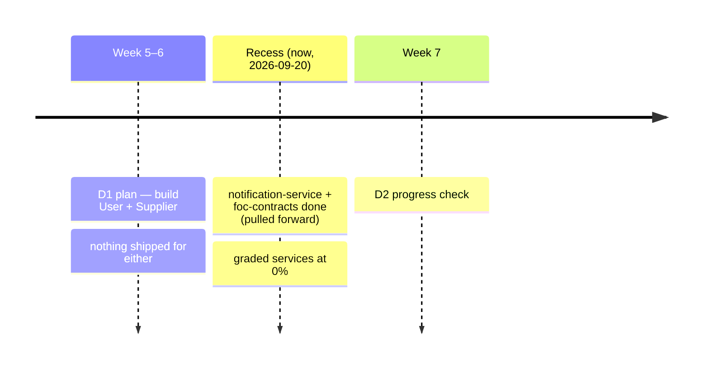
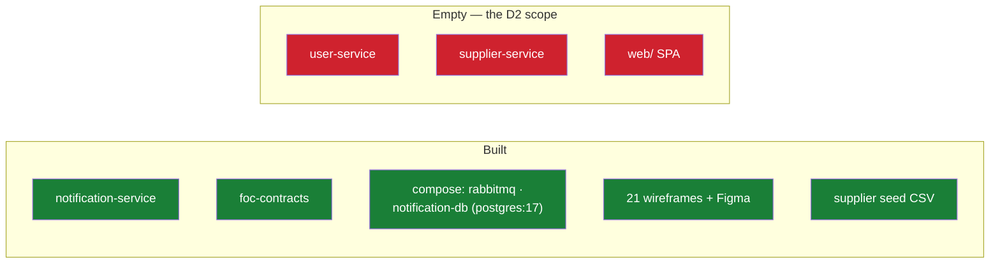
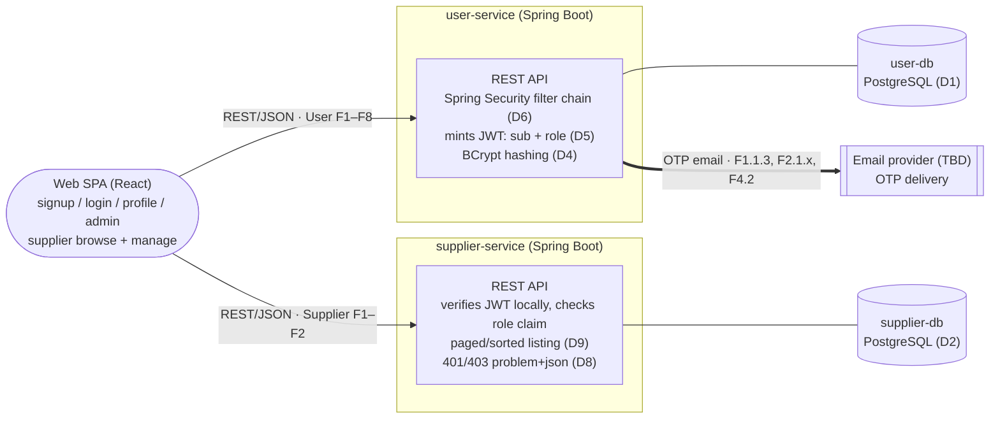
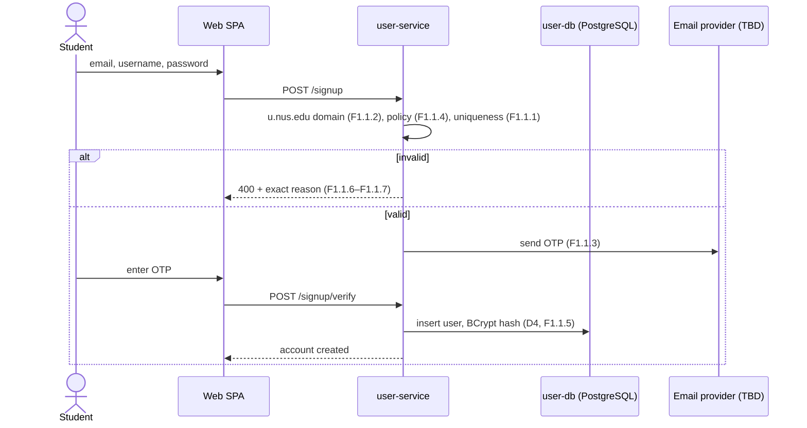
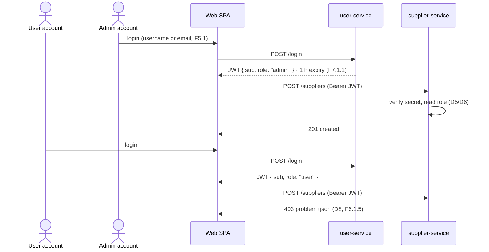
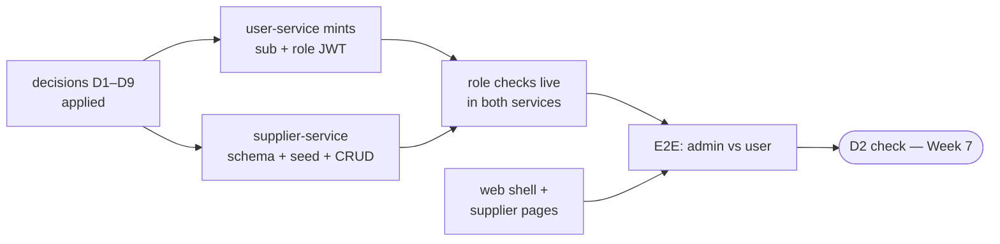

<!--
  AI-assisted (CS3219 AI Usage Policy disclosure):
  Tool: Claude Code (Fable 5), 2026-09-20.
  Scope: status inventory, D1-backlog traceability, and D2 rubric gap
  analysis compiled from the course D2 instructions, the team's D1
  document, and repo/issue state; role matrix transcribed from the
  backlog; diagrams drawn from docs/architecture.md plus the decisions
  below. Decisions D1-D9 were made by Leong Wei Zhi (2026-09-20) via
  neutral-options Q&As (ai/usage-log.md); deferred decisions are Open
  items, recorded without analysis. Same-day revisions: style-guide
  compliance pass, then a readability rewrite on author feedback
  (short points, diagrams over prose; no decision, status, or
  open-item content changed).
  No requirements, architecture, or trade-off decisions were made by
  the tool.
  Reviewed by: Leong Wei Zhi (via pull request).
-->

# Technical Solution — D2 Progress-Check Readiness — User & Supplier Services

## Background

- **GitHub issues:** User [#1–#9](https://github.com/AY2627S1-CS3219-P23/foc/issues/1) + #32–#35 · Supplier #10–#11 + #36–#37 · UI #43
- **Design doc:** [architecture.md](architecture.md)
- **Figma:** [Backlog Mockup](https://www.figma.com/design/HZ25RDhbcsBycXG7K7xrFf/Backlog-Mockup?m=auto&t=jQwFXEoz5ucD66x4-6) · [`web/docs/wireframes/`](../web/docs/wireframes/)
- **Requirements:** User F1–F8 + NFR1–4 · Supplier F1–F2 + NFR1–2 · UI NFR1 (D1 backlog)
- **Decisions:** D1–D9 (below) · JWT `sub` convention (issue #67) · D15 contracts ([notification-service.md](notification-service.md))
- **Participants:**
    - **User Service owner:** Kwey Xiu Xi
    - **Supplier Service owner:** Alastair Tan Choon Wei
    - **Frontend:** per-domain owners ([`web/AGENTS.md`](../web/AGENTS.md))
    - **Author/scribe:** Leong Wei Zhi
- **References:** CS3219-Instructions-MilestoneD2.pdf · D1 document (Template-7) · [credit-service.md](credit-service.md) · `AGENTS.md` (M1–M7, deadlines, AI policy)

## Overview

D2 (Week 7, 20–30 min): one of User/Supplier Service **near-complete**, the other at **significant progress**, live demo, reasoned decisions. `AGENTS.md` also names a **supplier-listing page** for the demo.



This doc: status → rubric gaps → decisions D1–D9 → architecture → plan → demo script → open items.

## Where we stand

> 🔴 `user-service/` and `supplier-service/`: three 0-byte files each. `web/`: wireframes only, no project. All 18 D2 issues (#1–#11, #32–#37, #43) open, zero linked PRs. Verified 2026-09-20 — commands in [Testing](#testing).



Reusable now:

| Asset | Why it matters |
| --- | --- |
| [`JwtVerifier`](../notification-service/src/main/java/foc/notification/security/JwtVerifier.java) + `JwtVerifierTest` | verifier half of the token scheme; User Service mints against it |
| `.env.example` — `JWT_SECRET`, `JWT_*_TTL` | token config slots reserved |
| `sub` = platform user ID (issue #67) | minting convention fixed |
| `compose.yaml` `notification-db` row | copy-pattern for `user-db` / `supplier-db` |
| [`data/csv/supplier-seed-data.csv`](../data/csv/supplier-seed-data.csv) (21 rows) | course requires seeding from `data/`; mapping → Open item |

### Backlog status

Every row: **Not started**. Weeks 5–6 have passed.

| Service | Groups (issue) | Planned |
| --- | --- | --- |
| User | F1 signup+OTP (#1) · F2 update (#2) · F3 delete (#3) · F4 recovery (#4) · F5 login+lockout (#5) · F6 roles/admin (#6) · F7 sessions (#8) · F8 profile (#9) · NFR1 hashing (#32) · NFR4 integrity (#35) | Weeks 5–6 |
| User, later by plan | F6.2 owner (#7) Week 11 · NFR2 60k (#33), NFR3 2 s (#34) Week 12 | Weeks 11–12 |
| Supplier | F1 CRUD+browse (#10) · F2 search/filter (#11) · NFR1 ≤5 s listings (#36) · NFR2 100k (#37) | Weeks 5–6 |
| Supplier, later by plan | NFR1.1.1 caching (#36) | Week 11 |
| UI | NFR1 responsive (#43) | Week 6 |

## D2 rubric gaps

Grading cuts: near-complete = Part 1 pts 1–6 / Part 2 pts 1–5; significant = pts 1–4. Target (D3): **User near-complete, Supplier significant**.

### Part 1 — User Service

| # | Asks | Have today | Demo needs |
| --- | --- | --- | --- |
| 1 | roles + capability artifact | matrix below | keep it updated |
| 2 | DB, schema, credential storage | PostgreSQL (D1) · BCrypt (D4); schema = owner work | schema walk; hashed row |
| 3 | authn + RBAC, live | `sub` fixed · `role` claim (D5) · Spring Security (D6); no code | login → JWT; gated endpoint |
| 4 | Supplier enforces via User identity | verifier exists; supplier side absent | one token, both services; non-admin blocked |
| 5 | profile updates; protected fields | F2 flows; field rule → Open item | protected-field update rejected |
| 6 | first admin; promotion; edge cases | bootstrap flag (D7); edge cases → Open item | bootstrap + promote live |

### Part 2 — Supplier Service

| # | Asks | Have today | Demo needs |
| --- | --- | --- | --- |
| 1 | DB, schema, metadata | PostgreSQL (D2); seed mapping → Open item | schema + seeded rows |
| 2 | query patterns, APIs, denied responses | paging req added (D9) · problem+json (D8); no code | by-id, search, filter, page; 401/403 |
| 3 | CRUD via API, UI-independent | — | curl demo, UI stopped |
| 4 | E2E auth flow, roles differ | blocked on D5 minting | admin vs user flow |
| 5 | responsive UI, live data | wireframes only | desktop + mobile, no mocks |

### Roles (rubric P1.1 artifact)

Transcribed from backlog F6/F8. Keep updated through the final presentation.

| Role | Obtained | Can do |
| --- | --- | --- |
| **user** (default) | sign-up (F1.1) | requester + courier modes, no re-login (F6.1.1) · own account F2–F4 · own profile F8.1 · public profiles F8.1.1 · unpermitted actions rejected with message (F6.1.5) |
| **admin** | promotion (F6.1.4); first via bootstrap (D7) | user + list all (F6.1.2) · remove accounts (F6.1.3) · promote/demote (F6.1.4) · supplier CRUD (Supplier F1.1) |
| **owner** (Week 11, Low) | first registrant (F6.2.1) | admin-equivalent (F6.2.2) · exactly one, transfer before delete (F6.2.3) · not editable by admins (F6.2.4) |

## Design decisions (made by the team)

By **Leong Wei Zhi, 2026-09-20**, from neutral-options Q&As (`ai/usage-log.md`); owners review via this PR. Per-document D-series.

| # | Concern | Decision | Serves |
| --- | --- | --- | --- |
| D1 | User DB | **PostgreSQL** — engine already in repo (`notification-db`) | F1–F8; NFR2/4 |
| D2 | Supplier DB | **PostgreSQL** — same grounds | F1–F2; NFR2 |
| D3 | D2 target | **User near-complete · Supplier significant** | scoping |
| D4 | Hashing | **BCrypt** — NFR1.1's "or equivalent" clause | F1.1.5; NFR1.1 |
| D5 | Role in token | **single `role` claim** beside `sub`; read locally, no callback | F6.1.5; P1.3–4 |
| D6 | RBAC mechanism | **Spring Security filter chain** (`spring-boot-starter-security`) | F6.1.2–5; P1.3 |
| D7 | First admin | **one-time bootstrap endpoint/flag** — active only while zero admins exist | P1.6 |
| D8 | Denied requests | **RFC 9457 problem+json** — 401 no/invalid token, 403 wrong role | F6.1.5; P2.2 |
| D9 | Paging/sorting | **adopted as requirement** (absent from backlog) — Spring Data `Pageable`; issue to file | P2.2/2.5 |

> ✍️ "Why" answers at the check come from the deciders — the AI policy bars tool-written rationales. Undecided items → [Open items](#open-items).

## Target architecture (D2 slice)

From [architecture.md](architecture.md) + D1–D9. No gateway — each service verifies the HS256 `JWT_SECRET` locally. **Diagram source:** [`d2-progress-check.mmd`](d2-progress-check.mmd).



> ✍️ Paths like `POST /signup` are illustrative — API design stays with the owners (AI policy).
>
> ℹ️ Sign-up also calls Credit Service (5 starting credits, Credit F1.1); it is a stub today → Open item.

### Existing verifier

Real code today — [`JwtVerifier`](../notification-service/src/main/java/foc/notification/security/JwtVerifier.java); minted tokens must pass it, supplier-side checks can mirror it:

```java
public String verifiedSubject(String token) {
    Jws<Claims> jws = parser.parseSignedClaims(token);
    // Defense in depth: the platform convention is HS256 exactly.
    // (The signature was already verified against the shared key.)
    if (!"HS256".equals(jws.getHeader().getAlgorithm())) {
        throw new MalformedJwtException("unexpected signature algorithm");
    }
    String subject = jws.getPayload().getSubject();
    if (subject == null || subject.isBlank()) {
        throw new MalformedJwtException("token has no subject");
    }
    return subject;
}
```

Built eagerly: missing/short `JWT_SECRET` fails startup (`MIN_SECRET_BYTES = 32`).

### Sign-up with OTP (F1.1)



### Login → role-checked supplier CRUD (F5, F6.1.5)



Denied shape (D8) — Spring `ProblemDetail` stock output; field population is owner work:

```json
{
  "type": "about:blank",
  "title": "Forbidden",
  "status": 403,
  "detail": "...",
  "instance": "/suppliers"
}
```

## Plan to Week 7



| Workstream | Owner | Issues | Blocked by |
| --- | --- | --- | --- |
| User core: signup/login/JWT/RBAC/admin/profile | Kwey Xiu Xi | #1 #5 #6 #8 #9 #32 | `user-db` infra (own PR, house convention) |
| User OTP flows: update/delete/recovery | Kwey Xiu Xi | #2 #3 #4 | email provider → Open item |
| Supplier backend: schema/seed/CRUD/search/paging | Alastair Tan | #10 #11 #37 + D9 issue | seed mapping → Open item; role claim for E2E |
| Web: shell + supplier pages (desktop + mobile) | per-domain (`web/AGENTS.md`) | #43 | live APIs — rubric forbids mocks |
| Demo data: accounts + suppliers | owners | — | — |

> 🔴 Everything role-gated waits on User Service minting `sub`+`role`. Dev stopgap: hand-mint on the shared secret — never in the demo.

## Demo script (20–30 min)

| # | Rubric | Show |
| --- | --- | --- |
| 1 | P1.1 | role matrix + live roles |
| 2 | P1.2 | `user-db` schema; a BCrypt-hashed row |
| 3 | P1.3 | login → decoded JWT (`sub`, `role`, `exp`); endpoint with/without token |
| 4 | P1.6 | bootstrap first admin (D7); promote in-app; edge-case answers |
| 5 | P1.5 | protected-field update rejected |
| 6 | P2.1–3 | supplier CRUD/search/filter/page via curl, UI stopped |
| 7 | P1.4 + P2.4 | admin token works on supplier-service; user token → 403 |
| 8 | P2.5 | supplier pages at desktop + mobile widths, live data |
| 9 | wrap | diagrams + "why" answers from the deciders |

## Testing

Testable today: this doc's claims, and the existing stack. Per-service run-books arrive with owners' PRs (pattern: [`notification-service/README.md`](../notification-service/README.md); Testcontainers, auto-skip without Docker).

### Reproduce the status audit

```sh
# graded services: 6 files, all 0 bytes
git ls-files user-service supplier-service | xargs ls -la

# no signup/domain code anywhere
grep -rn "u.nus.edu" --include="*.java" .   # no output

# D2 issues all open (#1–#11, #32–#37, #43)
gh issue list --state open --limit 60
```

### Run what exists

```sh
(cd foc-contracts && ./mvnw install)          # one-time (D15)
(cd notification-service && ./mvnw test)      # H2, no infra

# cp .env.example .env; set NOTIFICATION_DB_PASSWORD,
# RABBITMQ_PASSWORD, JWT_SECRET (≥32 bytes)
docker compose up --build notification-service
```

Health: `GET http://localhost:${NOTIFICATION_SERVICE_PORT:-8085}/actuator/health`.

## Open items

Team decisions, recorded without analysis (AI policy). Options shown = those tabled at deferral (2026-09-20).

| Item | Blocks | Owner |
| --- | --- | --- |
| Logout token invalidation (F7.1.2) — tabled: denylist · refresh pair · session table | P1.3 answer | Kwey Xiu Xi / team |
| OTP email provider — tabled: Gmail SMTP · transactional API · AWS SES | User F2–F4; #2–#4 | Kwey Xiu Xi / team |
| Seed mapping: CSV `Type` vs "categories" · `Location Description` vs "description" · no zone column (F2.2) | P2.1; seeding | Alastair Tan |
| Role edge cases: admin self-revoke; last admin delete/demote (P1.6) | P1.6 answer | team |
| Protected profile fields rule (P1.5) | P1.5 answer | Kwey Xiu Xi |
| Sign-up's Credit call (F1.1) while `credit-service/` is a stub | sign-up demo | team (Ryan Ang) |
| Supplier caching (NFR1.1.1, Week 11) — tabled: in-process · shared cache | post-D2 | Alastair Tan / team |

## Follow Up

- File the D9 paging/sorting issue (`service:` / `priority:` / `sprint:` labels).
- `user-db` / `supplier-db`: compose rows, `.env.example` vars, `AGENTS.md` port-table rows — each owner's own PR.
- `docs/user-service.md` / `docs/supplier-service.md` (+ `.mmd`): long-term homes; D1–D9 migrate there.
- architecture.md: strike the two resolved engine TBDs after merge.
- No CI yet (`.github/` absent; N5.2 planned Recess) — demo runs on local compose.
- Refresh the status tables here after each merged PR.
